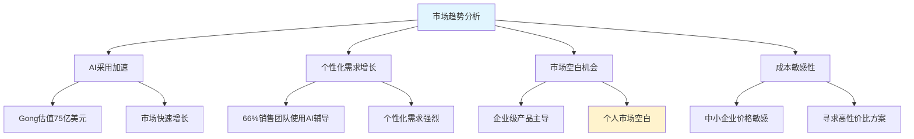
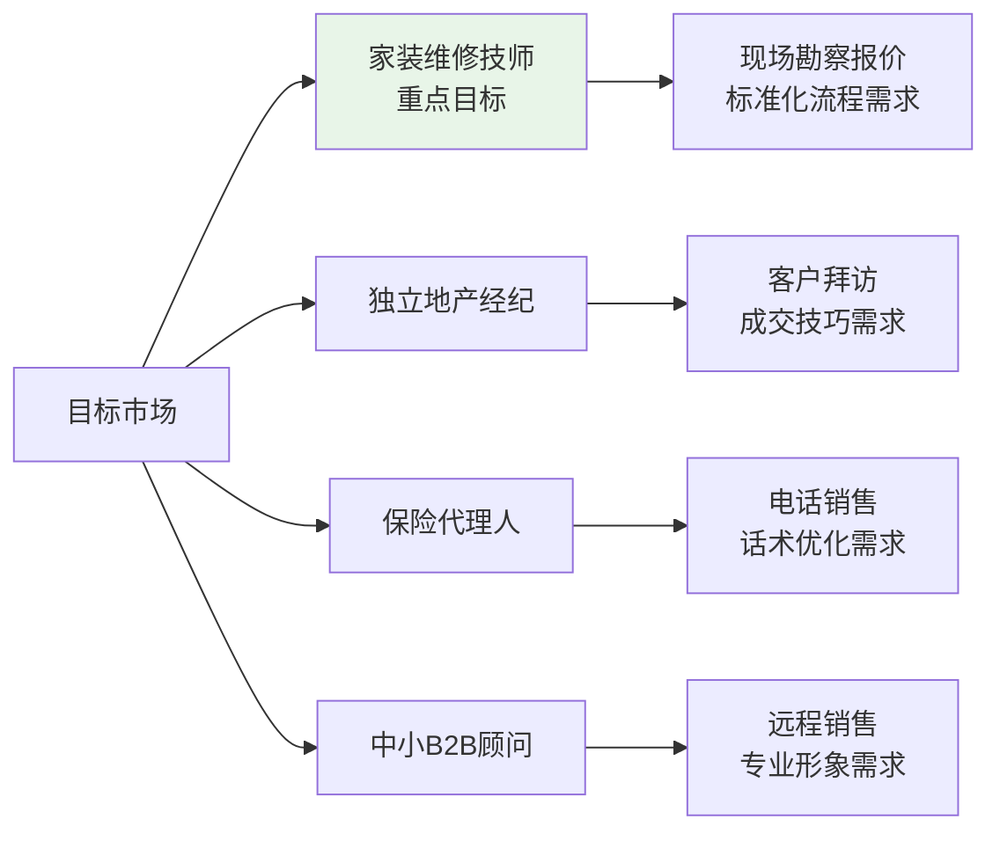

# CallWise-AI（销教通）机会评估

## 1. 项目概述

### 1.1 项目名称
CallWise-AI（销教通）

### 1.2 项目愿景
通过AI技术赋能个人销售专业人士，提供智能对话分析、个性化辅导反馈和趋势追踪，让每位销售都拥有专属的AI教练，持续提升销售沟通能力和成交率。

## 2. 市场机会分析

### 2.1 市场定位与品类归属
基于G2平台分类，CallWise-AI定位为：
- **Sales Coaching**: AI赋能销售对话辅导工具
- **Conversation Intelligence**: 对话深度分析与情感挖掘
- **Revenue Intelligence**: 通话数据预测与决策辅助

### 2.1.1 执行摘要
- **市场机会**: 大量独立销售人员缺乏系统辅导与反馈渠道，普通CRM与商学院课程无法提供针对性、即时性提升手段
- **产品定位**: CallWise-AI（销教通）基于AI对用户电话或录音进行自动评分、个性化反馈与趋势跟踪，打造属于个人销售员的"全天候AI教练"
- **目标结果**: 帮助个人销售者提升成交率、提高沟通技巧、减少盲点与重复错误判断

### 2.2 目标市场细分
- **个人销售专业人员**: 地产、保险、家装、中小B2B顾问等
- **独立销售/自由顾问**: 缺乏系统化辅导的个人销售者
- **单兵销售**: 外出拜访或远程通话场景
- **中小型团队**: 预算敏感、快速部署需求

### 2.2.1 市场规模估算（2024年数据更新）
- **全球对话智能市场**:
  - 2024年市场规模：12.5亿美元（Business Research Insights）
  - 预计2033年达到187亿美元，年复合增长率约30%
  - 另一数据源显示2024年达到25.3亿美元（Future Market Insights）
- **全球对话AI市场**: 2024年达到122.4亿美元（Fortune Business Insights）
- **美国独立销售从业者**: 约500万名（*官方统计数据未找到最新精确数字*）
- **中国销售从业者市场**: （*国家统计局数据需要进一步细分查询*）
- **市场价值估算**: 基于对话智能市场12.5-25.3亿美元规模，个人市场潜力巨大
- **AI销售工具采用率**: 66%的销售团队正在使用AI工具进行个性化辅导（2024年数据）

### 2.3 市场痛点分析
- **P1：缺乏即时有效反馈** — 无公司辅导资源，无法迅速识别沟通盲点
- **P2：难评估自身进步** — 没有标准评分体系与趋势反馈，成长不直观
- **P3：工具门槛高、价格昂贵** — 企业级产品体量大、不适合个人用户使用

### 2.4 竞争优势定位
- **差异化优势**: 专注中文市场，本地化AI模型
- **技术优势**: 离线模式支持、实时情感分析
- **成本优势**: 显著价格优势（竞品$100-250/用户/月 vs 我们$29-59/月）
- **部署优势**: 轻量级部署，快速上线，个人用户友好

### 2.5 市场趋势洞察（2024年更新）

### 2.6 目标市场细分可视化

## 3. 商业可行性

### 3.1 收入模式
- **Freemium + 订阅制**: 免费版本+付费升级
- **按反馈次数计费**: 每次反馈1美元
- **差异化定价**: 个人版$29/月，专业版$59/月，团队版$99/月

### 3.2 成本结构
- **开发成本**: 6-12个月开发周期
- **运营成本**: 云服务、AI模型训练
- **营销成本**: 市场推广和销售

### 3.3 盈利预测
- **第一年**: 收支平衡
- **第二年**: 20%利润率
- **第三年**: 35%利润率

## 4. 竞品分析与风险评估

### 4.1 通话销售辅助AI功能优先级分析

基于市场调研，我们将通话销售辅助AI功能按优先级和市场成熟度分为10个层级：

#### 🥇 **优先级1-3：核心基础功能**
1. **通话录音 & 自动转录**
   - 所有平台自动记录并转录销售通话，为后续分析和回顾提供基础
   - 代表产品：Gong自动帮助语音生成可搜索文本

2. **关键词/主题跟踪与情感识别**
   - 自动识别竞争对手名称、价格异议、情绪变化、客户兴趣等关键词
   - 生成动态标记与趋势分析
   - 代表产品：Salesforce Einstein可以标记自定义关键词并统计出现频率

3. **AI自动评分与Scorecard**
   - 根据预设标准（如MEDDIC、BANT、SPICED）自动评分对话
   - 并输出表现弱点
   - 代表产品：Avoma和Enthu.AI支持自定义或预置评分体系并实时打分

#### 🥈 **优先级4-6：进阶辅导功能**
4. **实时答疑指导/Live Coaching**
   - 通话中实时提出提示卡、对客户异议、产品问题、行业术语给出推荐回应或动态议
   - 代表产品：Avoma的live answer cards是典型示例

5. **团队分析与教练协作功能**
   - 生成高效通话片段集锦（playlists），允许经理批注、评论并共享最佳示例
   - 代表产品：Chorus与Salesforce支持coach主管和精选库功能

6. **个性化AI推荐与行动提醒**
   - 根据通话分析生成或建议进议、配件模板、行动任务（如发送案例、制定报价后跟进等）
   - 代表产品：Highspot Copilot、Pipedrive Assistant

#### 🥉 **优先级7-10：高级分析功能**
7. **销售/Metrics趋势仪表盘**
   - 管理层可查看团队统计、处理连接率、Talk-Listen比、赢单率、风险客户等
   - 中期增值功能
   - 代表产品：Highspot、Gong、Salesforce等提供全局报表分析功能

8. **销售漏斗/交易预测智能**
   - 基于通话内容、跟进频率、关键词频率等预测交易赢单概率及金额
   - 文化、提供风险提醒
   - 代表产品：Gong的Deal Intelligence、Mindtickle的account health score和Einstein forecast等基于此类

9. **CRM与会议系统集成**
   - 与CRM（如Salesforce、Pipedrive）、会议平台（Zoom、Teams）、邮件系统实时同步数据
   - 代表产品：Avoma、MeetRecord、Enthu.AI与多数工具高度集成

10. **定制学习路径与培训推荐**
    - 系统基于通话弱点推荐培训训练课程、备忘录表模板、培训材料
    - 代表产品：Mindtickle和Highspot提供动态培训路径与内容推荐功能

### 4.2 CallWise-AI（销教通）的市场定位

基于以上分析，我们的产品定位在**优先级1-4**的核心功能，专注于：
- ✅ **通话录音与转录**（优先级1）
- ✅ **AI自动评分与Scorecard**（优先级3）
- ✅ **个性化反馈与建议**（优先级6的简化版）
- 🔄 **实时辅导提示**（优先级4，后期迭代）

### 4.3 竞品对比分析（2024年更新）

| 竞品类别 | 代表产品 | 最新定价 | 目标用户 | 我们的差异化优势 |
|---------|---------|----------|----------|-----------------|
| 企业级全功能平台 | Gong | $250+/用户/月 | 大型企业团队 | **10倍价格优势**，个人友好 |
| 企业级平台 | Chorus | $150+/用户/月 | 中大型企业 | 轻量化部署，快速上线 |
| 会议分析工具 | Avoma | $100/用户/月 | 中小团队 | 专注销售辅导，非泛用工具 |
| 销售培训平台 | Mindtickle、Highspot | $100+/用户/月 | 企业培训部门 | 即时反馈，无需复杂体系 |
| **我们的产品** | **CallWise-AI** | **$29-59/月** | **个人销售专业人士** | **专属AI教练、中文优化、价格亲民** |

**关键洞察**: 现有产品均面向企业用户，个人销售市场存在明显空白，我们的定价具有显著竞争优势。

### 4.4 技术风险评估（更新）
- **AI模型准确性风险**：中文语音识别准确性需达95%+（高于英文90%标准）
- **实时处理性能**：移动端录音上传和云端分析的延迟控制
- **数据安全合规**：录音内容加密存储，符合GDPR、个保法等法规
- **技术依赖风险**：OpenAI API限制，需要备选方案

### 4.5 市场竞争风险（更新）
- **国际巨头下沉**：Gong（75亿美元估值）等可能推出个人版产品
- **本土竞争加剧**：国内厂商快速跟进类似功能（*需要调研中国竞品现状*）
- **用户教育成本**：个人销售对AI辅导工具的接受度培养
- **市场集中度**：企业级产品主导，个人市场教育需要时间

### 4.6 运营执行风险
- **技术团队能力**：AI/ML和移动开发技能匹配
- **产品迭代速度**：快速响应用户反馈，持续优化模型
- **商业化节奏**：平衡免费体验与付费转化的时机

## 5. 成功指标 (KPIs)

### 5.1 产品功能指标（2024年标准更新）
- **录音转写准确率** ≥ 95%（中文语音识别新标准，优先级1功能）
- **AI评分一致性** ≥ 85%（与人工评分对比，优先级3功能）
- **关键词识别准确率** ≥ 80%（优先级2功能）

### 5.2 用户体验指标
- **首次使用完成率** ≥ 80%（录音→分析→反馈全流程）
- **AI建议接受率** ≥ 50%（用户标记"有用"的比例）
- **用户满意度评分** ≥ 4.0/5.0（建议质量评价）

### 5.3 用户留存指标（新增30日指标）
- **7日留存率** ≥ 60%（新用户7天后仍活跃）
- **30日留存率** ≥ 35%（新增关键指标）
- **月度活跃率** ≥ 40%（至少一次录音分析）
- **平均使用频次** ≥ 3次/周（活跃用户）

### 5.4 商业化指标（新增成本指标）
- **免费转付费转化率** ≥ 15%（3个月内）
- **平均收入每用户(ARPU)** ≥ $100/年
- **客户生命周期价值(LTV)** ≥ $300
- **客户获取成本(CAC)** ≤ $50（新增）
- **LTV/CAC比率** ≥ 6:1（健康指标）

## 6. 时间线规划

### 6.1 市场验证 & 调研 (2周)
- 用户访谈、需求确认

### 6.2 MVP开发 (4-6周)
- 核心录音 -> 分析 -> 反馈流程实现

### 6.3 私测上线 (第8周)
- 5-10名个人销售Beta测试

### 6.4 首次迭代上线 (第10-12周)
- 根据反馈优化模型与UI，发布1.0版本

## 7. 资源需求

### 7.1 团队配置
- **产品经理**: 1人
- **UX设计**: 1人
- **前后端开发**: 2人（App + 后端）
- **AI工程师**: 1人（语音/LLM）

### 7.2 预算估算
- **前3个月投入**: 约$150K，覆盖开发与用户测试成本

## 8. 结论和建议

### 8.1 机会评估结果
**推荐进行项目开发** - 市场机会明确，技术可行，商业前景良好。

### 8.2 关键成功因素
1. **AI提议质量与用户信任建立**
2. **顺畅体验设计让用户愿意持续使用**
3. **Freemium定价降低上手成本，导入持续转化机制**

### 8.3 假设与风险
- **假设**: 用户愿意主动录音复盘且相信AI建议价值
- **假设**: 对话评分与建议能准确提升销售效果
- **风险**: AI提建议不准确导致用户流失/信任下降
- **缓解**: 通过反馈机制收集纠错，持续训练模型提升准确性

### 8.4 下一步行动（优先级排序）
**第一优先级（立即执行）**:
1. **市场数据补充**: 收集中国销售从业者准确统计数据
2. **竞品深度调研**: 体验Gong、Avoma等产品最新功能和定价
3. **技术验证**: 中文语音识别准确率测试（目标95%+）

**第二优先级（2周内）**:
4. **用户访谈**: 深度访谈目标用户（个人销售、独立顾问）
5. **中国市场调研**: 分析本土竞品和监管环境
6. **MVP设计**: 基于用户反馈设计最小可行产品（参考：`10-mvp-design.md`）

**第三优先级（1个月内）**:
7. **技术架构**: 制定详细的技术实现方案（参考：`20-architecture.md`）
8. **商业策略**: 完善商业化和市场推广策略（参考：`30-business-strategy.md`）

---

**文档版本**: v1.4
**创建日期**: 2025-08-06
**最后更新**: 2025-08-06
**下次评审**: 2025-09-06

### 更新记录
- v1.4 (2025-08-06): **补充全球市场规模客观数据**
  - 更新全球对话智能市场规模（2024年12.5-25.3亿美元）
  - 补充全球对话AI市场数据（2024年122.4亿美元）
  - 标注仍需收集的具体数据缺口和收集建议
- v1.3 (2025-08-06): **基于网络调研的客观数据更新**
  - 更新竞品最新定价（Gong $250+/月，Avoma $100/月）
  - 添加2024年市场趋势数据（66% AI采用率，Gong 75亿估值）
  - 提升技术标准（中文语音识别95%+准确率）
  - 新增成本指标（CAC、LTV/CAC比率）
  - 标注需要补充的数据缺口
- v1.2 (2025-08-06): 添加详细的通话销售辅助AI功能优先级分析，更新竞品对比和成功指标
- v1.1 (2025-08-06): 统一产品命名，更新文档编号系统，完善下一步行动计划
- v1.0 (2025-08-06): 初始版本

### 数据缺口标注（更新后）
- ✅ **已补充**: 全球对话智能市场规模（12.5-25.3亿美元，2024年）
- 🔍 **仍需补充**: 中国销售从业者市场规模准确数据（国家统计局数据需细分查询）
- 🔍 **仍需调研**: 中国本土AI销售工具竞品现状（搜索结果有限，需要深度调研）
- 🔍 **仍需验证**: 美国独立销售从业者最新统计（官方数据未找到精确数字）

### 数据收集建议
- **中国市场数据**: 联系国家统计局或行业协会获取销售从业者细分统计
- **竞品调研**: 通过企查查、天眼查等平台调研中国AI销售工具公司
- **美国数据**: 查询美国劳工统计局(BLS)最新职业统计数据