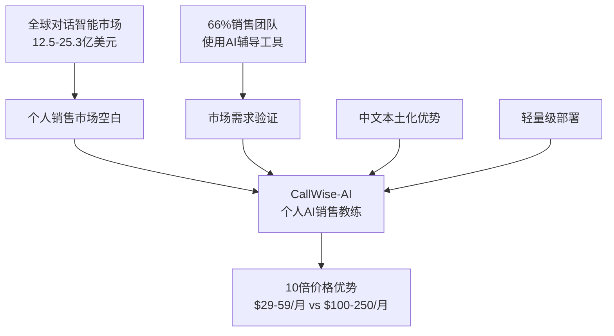
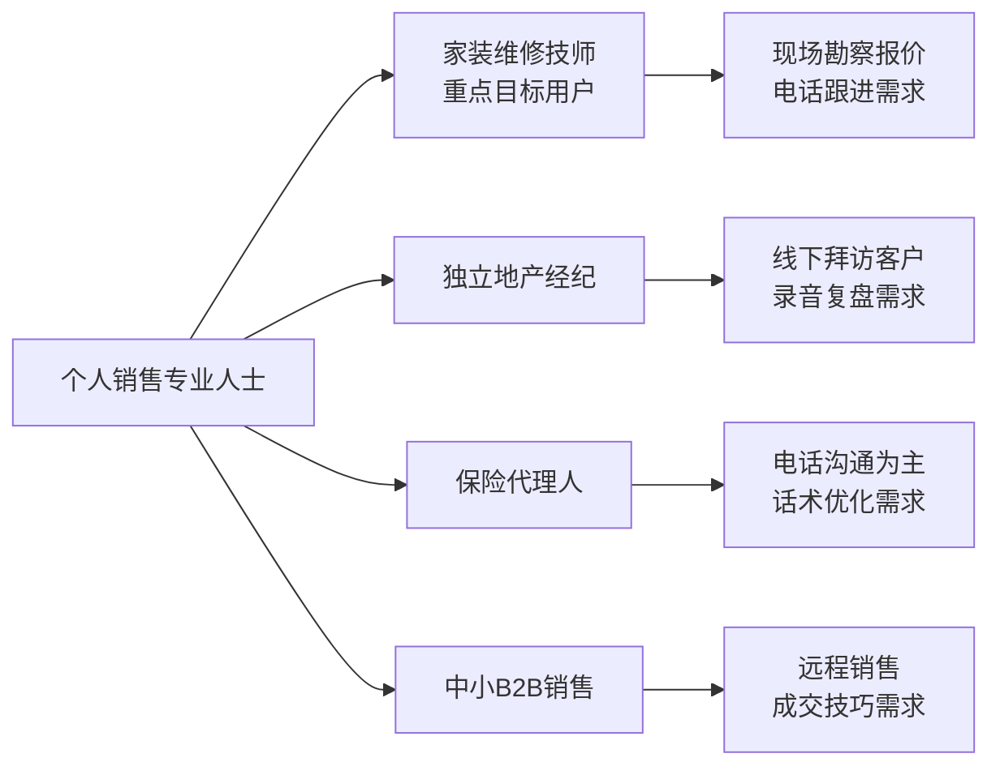
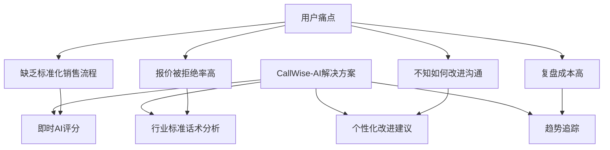
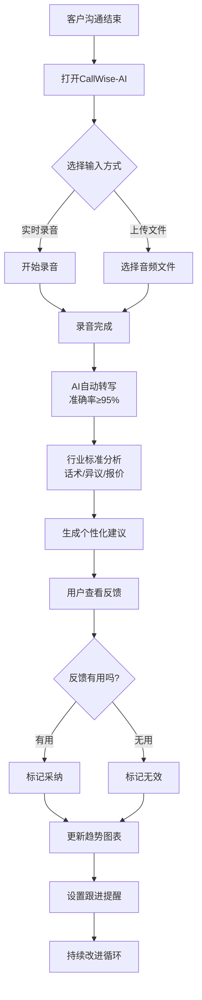
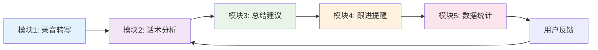
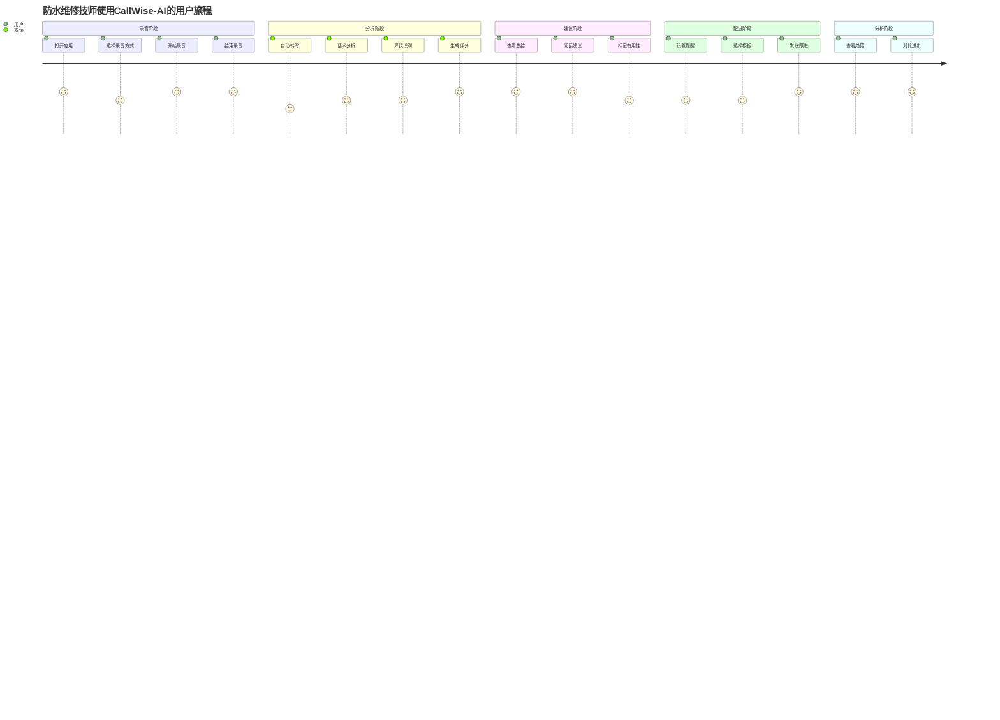

# CallWise-AI（销教通）MVP设计文档 v2.0

## 🎯 产品概述与市场定位

### 产品愿景与市场机会

**核心定位**：为个人销售专业人士提供专属AI教练，通过对话评分、个性化反馈与趋势追踪，持续提升销售沟通能力。

**Elevator Pitch**：CallWise-AI是首款面向个人销售的AI教练App，以10倍价格优势提供企业级对话智能功能。

## 👥 目标用户与使用场景

### 核心用户画像

### 用户价值主张

### 用户使用流程

### 重点用户故事
- 💧 **防水维修技师**：「我希望知道为什么客户对报价有异议，如何更专业地解释施工方案」
- 🏠 **地产经纪**：「通话结束后立刻收到评分与反馈，以便下次改进」
- 📞 **保险代理**：「系统指出我的提问深度有待加强，优化销售流程」

---

## 🧩 MVP核心功能模块

基于目标用户（家庭防水维修个体技师）实际需求，初期MVP应聚焦以下5个核心模块：

| 模块 | 功能名称 | 核心功能 | 技术要求 | 用户价值 | 验收标准 |
|------|----------|----------|----------|----------|----------|
| **1** | **通话录音 & 转写** | • 一键录音功能 • 多源录音支持 • 自动语音转文本 • 安全存储管理 | • 中文语音识别≥95% • 支持方言识别 • 多格式音频支持 • 加密存储 | • 便捷录音操作 • 准确文本转换 • 数据安全保障 | • 转写准确率≥95% • 录音操作≤3步 • 转写延迟≤30秒 |
| **2** | **异议/话术分析** | • 异议类型识别 • 话术效果分析 • 专业度评分 • 标准对比分析 | • AI对话分析模型 • 行业标准数据库 • 情感识别算法 • 关键词提取 | • 客观话术评估 • 异议处理改进 • 专业能力提升 | • 异议识别准确率≥80% • 分析完成≤30秒 • 评分一致性≥85% |
| **3** | **通话总结建议** | • 关键信息提取 • 结构化总结 • 个性化建议 • 改进方向指导 | • 自然语言处理 • 信息抽取算法 • 建议生成模型 • 模板匹配系统 | • 快速通话回顾 • 针对性改进 • 标准化总结 | • 生成≥3条建议 • 建议接受率≥50% • 总结完整度≥90% |
| **4** | **跟进提醒 & 模板** | • 智能话术推荐 • 跟进提醒设置 • 标准化模板 • 时机优化建议 | • 推荐算法 • 定时提醒系统 • 模板库管理 • 用户行为分析 | • 跟进效率提升 • 标准化沟通 • 时机把握优化 | • 模板匹配度≥80% • 提醒准确性100% • 模板使用率≥60% |
| **5** | **简单后台仪表盘** | • 通话分析统计 • 趋势图表展示 • 成功率统计 • 能力评估报告 | • 数据可视化 • 统计分析算法 • 图表生成引擎 • 报表系统 | • 成长可视化 • 激励持续使用 • 能力全面评估 | • 图表加载≤2秒 • 数据准确性100% • 趋势显示≥4次记录 |

### 模块间协作流程

### 🚀 后期可扩展模块（增值服务）

基于MVP验证成功后，可逐步扩展以下高级功能：

- **模拟对话训练与role-play反馈**：AI虚拟客户角色扮演，练习不同场景下的销售对话
- **多语言通话支持（视频、电话会议等）**：支持更多沟通渠道和语言
- **行业benchmark数据对比或优质成交案例库**：与同行业优秀案例对比分析
- **行业知识库（如材料说明、施工流程）**：提供专业知识支持和标准化流程
- **通话转化预测与赢单率评分模型**：基于历史数据预测成交概率

---

## 📱 用户界面与交互设计

### 用户操作流程

### 界面设计原则
- **Mobile-first**：界面简洁无负担，操作路径 ≤ 3步
- **行业化设计**：针对防水维修场景的专业术语和工作流程
- **直观操作**：使用熟悉设计模式（录音、时间轴、卡片样式）
- **引导机制**：首次使用引导（录音→分析→反馈→跟进）

> **架构设计详情请参考**: [系统架构文档](./20-architecture.md)

---

## 🧪 四、研发策略与技术选型

### 技术栈建议
- **跨平台**：React Native或Flutter（支持快开发与未来扩展）
- **AI模型**：使用已训练好的开源语音转写与对话分析模型（如Whisper + 自训练模型）
- **后端**：Node.js + SQLite（本地存储）+ 云端同步

### 产品功能概览

#### 核心功能（MVP）
- **录音功能**：支持手机端录音和批量上传音频文件
- **自动转写**：后台调用语音识别模型将通话转写为文本
- **Scorecard模型评分**：问询质量、异议处理、成交信号识别、填充词使用、客户发言占比等维度打分
- **AI建议生成**：基于Scorecard输出自然语言建议，如改进问题引导、强化需求挖掘
- **用户反馈交互**：用户可标记建议"有效"/"无用"，反馈用于训练模型
- **趋势仪表板**：显示时间维度评分变化、关键指标进步趋势图

#### 可选功能（后续迭代）
- **模拟对话练习**：AI模拟客户角色，用户进行role-play，系统评分与反馈
- **实时辅导提示**：通话过程中检测异议关键词或客户动向，提供实时建议弹窗
- **报告导出功能**：导出PDF总结报告，适用于分享或备案
- **社群功能**：用户可分享成绩卡片或进步摘要至同行社群，激励成长

### MVP路线与迭代策略
- **Sprint-based开发**：分1-2周小步快跑迭代核心流程
- **原型验证**：先用Figma/Whimsical绘制流程与核心界面，邀请目标用户测试
- **Beta测试**：发布Beta版给真实用户（5-10名个人销售用户）进行验证

---

## 📊 五、用户价值与商业目标

### 用户价值
- 获取即时、可操作的反馈
- 看到自身能力改进的趋势，增强使用动机

### 商业目标
- 完成录音流程 ≥ 80%的用户比例
- AI建议采纳率 ≥ 50%
- 月活 ≥ 40%
- 30%以上用户转换为付费用户

## 📊 六、MVP验证指标（Product-Market Fit KPI）

| KPI项目 | 目标值 | 说明 |
|---------|--------|------|
| 首次录音完整流程完成率 | ≥80% | 用户能够录音→查看标记→反馈 |
| AI建议接受率 | ≥50% | 用户接受建议比例，判断智能程度 |
| 日活跃用户比例 | ≥40% | 反馈活跃度是否足够高 |
| 用户反馈评分（建议质量） | ≥4/5 | 初期调查问卷评价建议的有用性 |
| 付费意图测试 | ≥30%提交付费意向 | 后期测试订阅转化意向 |

## 🎯 六、功能概览与需求优先级（MoSCoW）

### 🟢 Must-Have
- 录音上传/录音功能
- 自动转写生成文本
- Scorecard模型评分（问询、异议、Talk-Time等维度）
- AI建议（自然语言反馈）
- 用户反馈「接受/不准确」按钮
- 趋势面板显示评分变化

### ⚪ Should-Have
- 保存历史录音记录、支持回听
- 导出PDF报告
- 异议话术模板推荐

### ⚪ Could-Have
- 模拟对话（AI客户角色role-play）
- 实时辅导弹窗
- 语速/填充词统计图

### 🚫 Won't-Have（当前阶段不支持）
- CRM集成功能
- 多人团队协作功能

## 🎯 七、教练功能优先级排序

1. **自动评分&改进建议**（核心功能）
2. **反馈学习环节**（提升AI精准度）
3. **趋势仪表板/进度反馈**（提升用户持续感）
4. **虚拟对话练习**（中后期功能拓展）
5. **实时通话提示**（更复杂的实时模块，后期迭代）

---

## 🔄 六、迭代与后续规划

### 基于用户反馈和分析，决定引入：
- **对话摘要与关键指标仪表板**
- **Playbook/模板库**：用户可以自定义标语类型、话术脚本
- **CRM同步&交易进度预测能力**（面向更成熟个人或小团队）

### 逐步扩展至更复杂：
- 视频通话录制支持
- 跨平台集成（Zoom、WhatsApp）等

---

## 🧠 七、风险与假设分析

### 关键假设
- **用户行为假设**：用户愿意持续录音并查看反馈
- **AI价值假设**：AI建议对用户具有真实指导意义
- **市场假设**：个人销售愿意为AI教练功能付费

### 主要风险
- **AI模型风险**：AI模型评分不精准导致用户失去信任
- **用户体验风险**：用户体验流程复杂，导致弃用
- **市场接受度风险**：用户对AI建议的接受度不确定

### 缓解对策
- **技术对策**：建立反馈学习机制，逐步优化模型
- **体验对策**：优化UI流程，确保≤3步完成全部操作
- **市场对策**：通过免费试用降低用户门槛，建立信任

### Open Questions
- 用户对推荐语言反馈操作接纳度？
- AI建议文本风格需多样化配置吗？
- 数据隐私如何明确通知并获得授权？

### 总结建议
- **核心优先**：锁定"录音转写+关键动作识别+可用建议"作为唯一Killer Feature
- **快速验证**：通过与10位目标用户访谈与Beta测试验证使用场景与价值真实性
- **持续迭代**：简单UX、明确的反馈机制、可迭代AI学习能力

---

## 📋 八、发布计划与阶段里程碑

| 阶段 | 时间 | 输出内容 |
|------|------|----------|
| 初步原型设计与用户调研 | 第1-2周 | 用户流程原型，确定核心模块 |
| MVP开发 | 第3-8周 | 完成录音→分析→建议→仪表板流程 |
| 内部测试&调试 | 第9-10周 | 确保流程稳定，修复主要Bug |
| Beta测试上线 | 第11-12周 | 面向5-10名用户，收集使用反馈 |
| V1.0发布 | 第13周 | 集成用户反馈，上线App Store/Play Store |

### Stakeholders & 版本管理
- **Kickoff Workshop**：与设计、工程、AI团队召开2-3小时工作坊确认细节
- **迭代流程**：PRD草稿应结合早期技术与设计反馈多轮修订
- **版本控制**：使用Confluence/Notion做在线协作和版本管理，强调"活文档"概念

### Sprint 1 (2周) - 基础录音功能
- 手机App录音功能
- 基础文件上传
- 简单用户界面

### Sprint 2 (2周) - AI转写与分析
- 语音转写功能
- 基础关键词识别
- 简单时间戳标记

### Sprint 3 (2周) - 辅导反馈
- AI建议生成
- 用户反馈机制
- 基础数据统计

## 🎨 九、用户体验与界面概要

### 界面设计原则
- **首页界面**：大按钮"开始录音/上传音频"，简洁直观
- **分析界面**：Scorecard卡片+分项建议展示
- **反馈操作**：每条建议旁支持"接受/不准确"按钮
- **趋势仪表板**：周/月视角评分变化图，关键行为对比

### 用户体验要求
- **操作简洁**：≤3步完成全部操作
- **视觉清晰**：使用熟悉设计模式，避免学习成本
- **反馈及时**：实时显示分析进度和结果

### 用户体验流程 & 视觉草图建议
- **流程图**：建议画出用户从打开App→录音/上传→查看反馈→标记反馈→查看趋势的完整流程图
- **原型建议**：使用Figma绘制首页按钮布局、Scorecard卡片设计、趋势图Dashboard
- **稿件可视化建议**：每条建议旁放置「接受/无用」按钮，反馈一键提交

## 📋 十、功能详细规格与验收标准

| 核心模块 | 具体需求 | 验收标准 |
|----------|----------|----------|
| 模块1：通话录音&转写 | 支持多种录音源，自动语音转文本 | 录制时长≥3分钟，转写准确率≥90%，支持中文方言 |
| 模块2：异议/话术分析 | 识别异议类型，分析话术效果 | 异议识别准确率≥80%，话术评分范围0-100分 |
| 模块3：通话总结建议 | AI生成通话总结和改进建议 | 生成≥3条可执行建议，建议长度≥15字 |
| 模块4：跟进提醒&模板 | 智能推荐话术模板，设置跟进提醒 | 模板库≥20个，提醒设置响应≤2秒 |
| 模块5：简单后台仪表盘 | 个人使用统计和趋势分析 | 显示≥4次通话趋势，图表加载≤2秒 |

---

**文档版本**: v1.1
**创建日期**: 2025-08-06
**最后更新**: 2025-08-06
**下次更新**: 2025-09-06

### 更新记录
- v1.1 (2025-08-06): 融入MVP核心模块定位分析，重新定义5个核心模块，添加防水维修技师用户画像，更新后期扩展功能规划
- v1.0 (2025-08-06): 初始版本