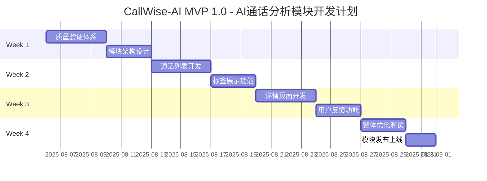

# CallWise-AI（销教通）激进4周MVP 1.0冲刺计划 🚀

## 🎯 产品愿景
通过AI技术赋能个人销售专业人士，提供智能对话分析、个性化辅导反馈和趋势追踪，让每位销售都拥有专属的AI教练，持续提升销售沟通能力和成交率。

## ⚡ 激进MVP 1.0目标 (4周)
**目标**：在现有销售移动APP中开发AI通话分析模块，提供完整的通话分析和反馈功能

### 🎯 MVP 1.0核心价值
- ✅ **已完成基础**：中继号语音获取→转写→AI总结（后端能力已存在）
- 📱 **移动端模块**：在现有APP中新增AI通话分析一级菜单模块
- 📋 **通话列表**：展示电话语音列表，每通电话显示关键AI标签
- 📄 **详情页面**：通话总结、完整标签、跟进建议的详细展示
- 💬 **用户反馈**：AI内容的用户反馈功能，持续优化AI效果
- 🔄 **质量验证**：验证转写和异议识别准确率，建立测试基准

### 📊 成功指标 (MVP 1.0)

| 指标 | 目标值 | 验证方式 |
|------|--------|----------|
| 移动端模块完成度 | 100%功能实现 | 功能测试验收 |
| 通话列表展示 | 关键标签清晰显示 | 用户体验测试 |
| 详情页面完整性 | 总结+标签+建议完整 | 内容完整性检查 |
| 用户反馈功能 | 反馈收集和处理 | 反馈数据统计 |
| 界面易用性 | ≤3步查看通话详情 | 用户操作测试 |
| 用户满意度 | ≥4.0/5 | 用户调研反馈 |

## 🎭 核心用户故事

### Epic 1: AI通话分析模块
**作为** 销售人员，**我希望** 在移动APP中有专门的AI通话分析模块，**以便** 快速查看和分析我的通话记录。

### Epic 2: 通话列表和标签展示
**作为** 销售人员，**我希望** 能在列表中快速看到每通电话的关键AI标签，**以便** 快速识别重要通话和问题。

### Epic 3: 详细分析和反馈
**作为** 销售人员，**我希望** 查看详细的通话总结、标签和建议，并能对AI分析结果进行反馈，**以便** 持续改进AI效果。

---

## 🏃‍♂️ 4周激进冲刺计划

### 📅 总体时间线

---

## 🧪 Week 1: 质量验证体系建立 (Aug 6-12)

### 🎯 Week 1 目标
基于现有的中继号语音获取和AI转写分析能力，建立质量验证体系，测试转写和异议识别准确率。

### 📋 Sprint Backlog

#### 🔍 质量验证体系搭建 (4天)
**TEST-001: 转写准确率测试框架**
- **任务**: 建立转写准确率测试体系，收集测试语音样本
- **验收**: ≥100个真实通话样本，人工标注基准，自动化测试脚本
- **优先级**: P0 | **工作量**: 16h | **负责人**: 测试工程师

**TEST-002: 异议识别准确率测试**
- **任务**: 建立异议识别测试数据集，标注异议类型
- **验收**: ≥50个包含异议的通话样本，异议类型标注，准确率计算
- **优先级**: P0 | **工作量**: 14h | **负责人**: AI工程师

**TEST-003: 性能基准测试**
- **任务**: 测试现有系统的处理速度和稳定性
- **验收**: 响应时间统计，并发处理能力测试，错误率统计
- **优先级**: P1 | **工作量**: 10h | **负责人**: 测试工程师

#### 📊 准确率验证 (3天)
**VAL-001: 转写质量评估**
- **任务**: 执行转写准确率测试，分析错误类型
- **验收**: 转写准确率报告，错误分析，改进建议
- **优先级**: P0 | **工作量**: 12h | **负责人**: AI工程师

**VAL-002: 异议识别验证**
- **任务**: 验证异议识别功能的准确性
- **验收**: 异议识别准确率报告，混淆矩阵分析
- **优先级**: P0 | **工作量**: 10h | **负责人**: AI工程师

### ✅ Week 1 交付物
- [ ] 完整的质量测试体系
- [ ] 转写准确率基准报告
- [ ] 异议识别准确率基准报告
- [ ] 系统性能基准报告
- [ ] 质量改进建议清单

---

## 📱 Week 2: 通话列表 + 标签展示功能 (Aug 13-19)

### 🎯 Week 2 目标
开发AI通话分析模块的核心功能：通话列表展示和关键标签显示，为用户提供快速浏览和筛选通话的能力。

### 📋 Sprint Backlog

#### 📋 通话列表开发 (4天)
**LIST-001: 移动端模块入口**
- **任务**: 在现有销售APP中添加AI通话分析一级菜单入口
- **验收**: 菜单入口清晰可见，点击进入通话列表页面，导航流畅
- **优先级**: P0 | **工作量**: 8h | **负责人**: 移动端工程师

**LIST-002: 通话列表页面**
- **任务**: 开发通话列表页面，展示所有通话记录
- **验收**: 列表展示通话时间、客户信息、通话时长，支持下拉刷新
- **优先级**: P0 | **工作量**: 16h | **负责人**: 前端工程师

**LIST-003: 列表数据接口**
- **任务**: 开发通话列表数据接口，支持分页和筛选
- **验收**: API接口稳定，支持分页加载，筛选功能正常
- **优先级**: P0 | **工作量**: 12h | **负责人**: 后端工程师

#### 🏷️ 标签展示功能 (3天)
**TAG-001: 关键标签设计**
- **任务**: 设计通话列表中显示的关键AI标签（3-5个最重要的）
- **验收**: 标签优先级算法，标签颜色编码，标签文案优化
- **优先级**: P0 | **工作量**: 10h | **负责人**: 产品经理

**TAG-002: 标签展示组件**
- **任务**: 开发标签展示组件，在列表中显示关键标签
- **验收**: 标签样式美观，颜色区分明确，支持点击筛选
- **优先级**: P0 | **工作量**: 14h | **负责人**: 前端工程师

**TAG-003: 标签筛选功能**
- **任务**: 实现基于标签的通话筛选功能
- **验收**: 支持多标签筛选，筛选结果准确，清除筛选功能
- **优先级**: P1 | **工作量**: 8h | **负责人**: 前端工程师

### ✅ Week 2 交付物
- [ ] AI通话分析模块入口
- [ ] 完整的通话列表页面
- [ ] 关键标签展示功能
- [ ] 标签筛选和搜索功能
- [ ] 列表数据接口和缓存

---

## 📄 Week 3: 通话详情页 + 用户反馈功能 (Aug 20-26)

### 🎯 Week 3 目标
开发通话详情页面，展示完整的AI分析结果（通话总结、标签、跟进建议），并实现用户反馈功能。

### 📋 Sprint Backlog

#### 📄 通话详情页开发 (4天)
**DETAIL-001: 详情页面架构**
- **任务**: 设计通话详情页面的信息架构和布局
- **验收**: 页面信息层次清晰，内容组织合理，导航便捷
- **优先级**: P0 | **工作量**: 10h | **负责人**: UI设计师

**DETAIL-002: 通话总结展示**
- **任务**: 开发通话总结展示组件，包括关键信息提取
- **验收**: 总结内容清晰，关键信息突出，支持展开收起
- **优先级**: P0 | **工作量**: 12h | **负责人**: 前端工程师

**DETAIL-003: 完整标签展示**
- **任务**: 在详情页展示所有AI标签，按类别分组显示
- **验收**: 标签分类清晰，支持标签说明，视觉效果良好
- **优先级**: P0 | **工作量**: 10h | **负责人**: 前端工程师

**DETAIL-004: 跟进建议展示**
- **任务**: 展示AI生成的跟进建议，支持建议的操作
- **验收**: 建议内容清晰，支持复制分享，建议优先级显示
- **优先级**: P0 | **工作量**: 8h | **负责人**: 前端工程师

#### 💬 用户反馈功能 (3天)
**FEEDBACK-001: 反馈功能设计**
- **任务**: 设计用户对AI分析结果的反馈机制和界面
- **验收**: 反馈入口明显，反馈类型完整，操作简单直观
- **优先级**: P0 | **工作量**: 8h | **负责人**: 产品经理

**FEEDBACK-002: 反馈收集组件**
- **任务**: 开发反馈收集组件，支持多种反馈类型
- **验收**: 支持点赞/点踩，文字反馈，问题分类，提交流畅
- **优先级**: P0 | **工作量**: 12h | **负责人**: 前端工程师

**FEEDBACK-003: 反馈数据处理**
- **任务**: 开发反馈数据收集和处理接口
- **验收**: 反馈数据存储，统计分析，反馈状态管理
- **优先级**: P0 | **工作量**: 10h | **负责人**: 后端工程师

### ✅ Week 3 交付物
- [ ] 完整的通话详情页面
- [ ] 通话总结展示功能
- [ ] 完整标签和建议展示
- [ ] 用户反馈收集功能
- [ ] 反馈数据处理系统

---

## 🚀 Week 4: 整体优化 + 模块发布 (Aug 27 - Sep 2)

### 🎯 Week 4 目标
完成AI通话分析模块的整体优化，进行全面测试，并正式发布到现有销售APP中。

### 📋 Sprint Backlog

#### 🔧 整体优化测试 (3天)
**OPT-001: 模块性能优化**
- **任务**: 优化AI通话分析模块的加载速度和响应性能
- **验收**: 列表加载≤2秒，详情页打开≤1秒，标签展示流畅
- **优先级**: P0 | **工作量**: 12h | **负责人**: 前端工程师

**OPT-002: 用户体验优化**
- **任务**: 优化交互流程，完善加载状态和错误提示
- **验收**: 加载状态清晰，错误提示友好，操作反馈及时
- **优先级**: P0 | **工作量**: 10h | **负责人**: UI设计师

**OPT-003: 数据展示优化**
- **任务**: 优化AI分析结果的展示效果，提升可读性
- **验收**: 信息层次清晰，重点内容突出，阅读体验良好
- **优先级**: P0 | **工作量**: 8h | **负责人**: 前端工程师

**OPT-004: 兼容性测试**
- **任务**: 测试模块在不同设备和系统版本上的兼容性
- **验收**: iOS/Android主流版本正常运行，不同屏幕尺寸适配
- **优先级**: P1 | **工作量**: 8h | **负责人**: 测试工程师

#### 🚀 模块发布上线 (2天)
**RELEASE-001: 发布前测试**
- **任务**: 进行完整的功能测试和用户验收测试
- **验收**: 所有核心功能正常，用户流程顺畅，无阻塞性bug
- **优先级**: P0 | **工作量**: 10h | **负责人**: 测试工程师

**RELEASE-002: 正式发布**
- **任务**: 将AI通话分析模块正式发布到现有销售APP
- **验收**: 模块成功上线，用户可正常访问，监控数据正常
- **优先级**: P0 | **工作量**: 6h | **负责人**: 运维工程师

**RELEASE-003: 用户引导**
- **任务**: 准备用户使用指南和功能介绍
- **验收**: 使用指南清晰，功能介绍完整，用户支持准备就绪
- **优先级**: P1 | **工作量**: 6h | **负责人**: 产品经理

### ✅ Week 4 交付物
- [ ] 性能优化的AI通话分析模块
- [ ] 完整的功能测试报告
- [ ] 正式发布的移动端模块
- [ ] 用户使用指南和支持文档
- [ ] 模块使用数据监控

---

---

## 📈 MVP 1.0成功指标

### 模块功能指标

| 指标 | 目标值 | 当前值 | 验证方式 |
|------|--------|--------|----------|
| 模块加载速度 | ≤2秒 | TBD | 性能测试 |
| 详情页打开速度 | ≤1秒 | TBD | 性能测试 |
| 通话列表展示 | 100%正确 | TBD | 功能测试 |
| 标签展示准确性 | ≥95% | TBD | 内容验证 |
| 移动端兼容性 | 100%支持 | TBD | 兼容性测试 |

### 用户体验指标

| 指标 | 目标值 | 当前值 | 验证方式 |
|------|--------|--------|----------|
| 模块使用率 | ≥60% | TBD | 用户行为分析 |
| 详情页查看率 | ≥80% | TBD | 用户行为分析 |
| 用户反馈提交率 | ≥30% | TBD | 反馈统计 |
| 用户满意度 | ≥4.0/5 | TBD | 用户调研 |
| 操作完成率 | ≥90% | TBD | 用户行为分析 |

### AI质量指标

| 指标 | 目标值 | 当前值 | 验证方式 |
|------|--------|--------|----------|
| 转写准确率基准 | 建立基准 | TBD | 人工标注测试 |
| 异议识别准确率基准 | 建立基准 | TBD | 人工标注测试 |
| 标签生成准确性 | ≥85% | TBD | 专家评估 |
| 建议相关性 | ≥80% | TBD | 用户反馈 |
| AI分析响应时间 | ≤30秒 | TBD | 性能监控 |

---

**文档版本**: v2.0 - 激进4周冲刺计划
**创建日期**: 2025-08-06
**最后更新**: 2025-08-06
**下次评审**: 2025-08-13 (每周评审)

### 更新记录
- v2.2 (2025-08-06): **AI通话分析移动端模块开发计划**
  - 重新聚焦于在现有销售APP中开发AI通话分析模块
  - Week 2: 通话列表和标签展示功能开发
  - Week 3: 通话详情页和用户反馈功能开发
  - Week 4: 整体优化和模块正式发布
  - 简化Week 3的知识库集成，专注于核心模块功能
  - 强调用户反馈功能的重要性
- v2.1 (2025-08-06): 基于现有能力的4周产品化冲刺计划
- v2.0 (2025-08-06): 激进4周MVP 1.0冲刺计划
- v1.0 (2025-08-06): 初始版本，基础Sprint规划