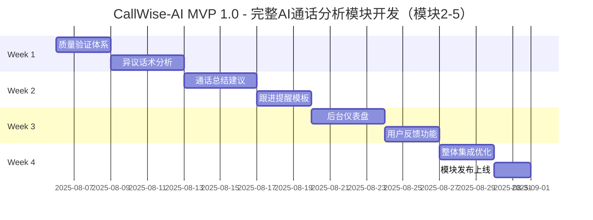

# CallWise-AI（销教通）激进4周MVP 1.0冲刺计划 🚀

## 🎯 产品愿景
通过AI技术赋能个人销售专业人士，提供智能对话分析、个性化辅导反馈和趋势追踪，让每位销售都拥有专属的AI教练，持续提升销售沟通能力和成交率。

## ⚡ 激进MVP 1.0目标 (4周)
**目标**：在现有销售移动APP中开发AI通话分析模块，提供完整的通话分析和反馈功能

### 🎯 MVP 1.0核心价值（基于MVP设计模块2-5）
- ✅ **已完成基础**：中继号语音获取→转写（模块1已存在）
- 🧠 **异议/话术分析**：异议识别、话术评分、专业度分析（模块2）
- 📝 **通话总结建议**：结构化总结、个性化建议、改进指导（模块3）
- ⏰ **跟进提醒&模板**：智能话术推荐、提醒设置、模板库（模块4）
- 📊 **简单后台仪表盘**：统计分析、趋势图表、能力评估（模块5）
- 💬 **用户反馈**：AI内容的用户反馈功能，持续优化AI效果

### 📊 成功指标 (MVP 1.0 - 基于模块2-5)

| 指标 | 目标值 | 验证方式 |
|------|--------|----------|
| 异议识别准确率 | ≥80% | 人工标注验证 |
| 分析完成时间 | ≤30秒 | 性能监控 |
| 评分一致性 | ≥85% | 多次测试对比 |
| 建议生成数量 | ≥3条/次 | 系统统计 |
| 建议接受率 | ≥50% | 用户反馈统计 |
| 总结完整度 | ≥90% | 内容完整性检查 |
| 模板匹配度 | ≥80% | 匹配算法验证 |
| 提醒准确性 | 100% | 提醒功能测试 |
| 图表加载速度 | ≤2秒 | 性能测试 |
| 数据准确性 | 100% | 数据验证 |

## 🎭 核心用户故事

### Epic 1: 异议/话术分析模块（模块2）
**作为** 销售人员，**我希望** 系统能识别客户异议类型并分析我的话术效果，**以便** 提升专业度和异议处理能力。

### Epic 2: 通话总结建议模块（模块3）
**作为** 销售人员，**我希望** 获得结构化的通话总结和个性化改进建议，**以便** 快速回顾和针对性提升。

### Epic 3: 跟进提醒&模板模块（模块4）
**作为** 销售人员，**我希望** 获得智能话术推荐和跟进提醒，**以便** 提高跟进效率和沟通标准化。

### Epic 4: 简单后台仪表盘模块（模块5）
**作为** 销售人员，**我希望** 看到我的通话分析统计和能力成长趋势，**以便** 持续激励和全面评估自己的进步。

---

## 🏃‍♂️ 4周激进冲刺计划

### 📅 总体时间线

---

## 🧠 Week 1: 质量验证 + 异议/话术分析模块 (Aug 6-12)

### 🎯 Week 1 目标
建立质量验证体系，开发异议/话术分析模块（模块2），实现异议识别、话术评分和专业度分析。

### 📋 Sprint Backlog

#### 🔍 质量验证体系搭建 (3天)
**TEST-001: 异议识别准确率测试**
- **任务**: 建立异议识别测试数据集，标注异议类型（价格、质量、时间等）
- **验收**: ≥50个包含异议的通话样本，异议类型标注，准确率≥80%
- **优先级**: P0 | **工作量**: 12h | **负责人**: AI工程师

**TEST-002: 话术评分一致性测试**
- **任务**: 建立话术评分测试体系，验证评分一致性
- **验收**: 评分一致性≥85%，多次测试结果稳定
- **优先级**: P0 | **工作量**: 10h | **负责人**: AI工程师

**TEST-003: 分析性能测试**
- **任务**: 测试分析完成时间，确保≤30秒响应
- **验收**: 分析响应时间≤30秒，并发处理能力测试
- **优先级**: P1 | **工作量**: 8h | **负责人**: 测试工程师

#### 🧠 异议/话术分析模块开发 (4天)
**ANA-001: 异议类型识别功能**
- **任务**: 开发异议类型识别算法，支持价格、质量、时间等异议分类
- **验收**: 异议识别准确率≥80%，支持多种异议类型
- **优先级**: P0 | **工作量**: 16h | **负责人**: AI工程师

**ANA-002: 话术效果分析**
- **任务**: 开发话术效果分析功能，评估沟通技巧和专业度
- **验收**: 话术评分算法，专业度评分，标准对比分析
- **优先级**: P0 | **工作量**: 14h | **负责人**: AI工程师

**ANA-003: 分析结果展示接口**
- **任务**: 开发分析结果数据接口，为前端展示提供数据
- **验收**: 结构化分析结果，API接口稳定，数据格式标准
- **优先级**: P0 | **工作量**: 10h | **负责人**: 后端工程师

### ✅ Week 1 交付物
- [ ] 异议识别准确率≥80%的测试验证
- [ ] 话术评分一致性≥85%的验证
- [ ] 完整的异议/话术分析模块
- [ ] 分析结果数据接口
- [ ] 性能基准测试报告

---

## 📝 Week 2: 通话总结建议 + 跟进提醒&模板模块 (Aug 13-19)

### 🎯 Week 2 目标
开发通话总结建议模块（模块3）和跟进提醒&模板模块（模块4），提供结构化总结、个性化建议和智能跟进功能。

### 📋 Sprint Backlog

#### 📝 通话总结建议模块开发 (4天)
**SUM-001: 关键信息提取**
- **任务**: 开发关键信息提取算法，从通话中提取重要信息
- **验收**: 信息提取准确率≥90%，支持客户需求、异议点、决策信号提取
- **优先级**: P0 | **工作量**: 14h | **负责人**: AI工程师

**SUM-002: 结构化总结生成**
- **任务**: 开发结构化通话总结功能，生成标准化总结格式
- **验收**: 总结完整度≥90%，包含通话要点、客户状态、下步行动
- **优先级**: P0 | **工作量**: 12h | **负责人**: AI工程师

**SUM-003: 个性化建议生成**
- **任务**: 基于通话分析生成个性化改进建议
- **验收**: 生成≥3条建议，建议针对性强，可执行性高
- **优先级**: P0 | **工作量**: 16h | **负责人**: AI工程师

#### ⏰ 跟进提醒&模板模块开发 (3天)
**FOL-001: 智能话术推荐**
- **任务**: 开发智能话术推荐算法，基于通话情况推荐合适话术
- **验收**: 模板匹配度≥80%，推荐话术相关性高
- **优先级**: P0 | **工作量**: 12h | **负责人**: AI工程师

**FOL-002: 跟进提醒设置**
- **任务**: 开发跟进提醒功能，支持智能时机建议和手动设置
- **验收**: 提醒准确性100%，支持多种提醒方式
- **优先级**: P0 | **工作量**: 10h | **负责人**: 后端工程师

**FOL-003: 标准化模板库**
- **任务**: 建立标准化话术模板库，支持模板管理和使用统计
- **验收**: 模板库≥20个模板，模板使用率≥60%
- **优先级**: P1 | **工作量**: 8h | **负责人**: 产品经理

### ✅ Week 2 交付物
- [ ] 完整的通话总结建议模块
- [ ] 个性化建议生成功能（≥3条建议）
- [ ] 智能话术推荐系统
- [ ] 跟进提醒功能
- [ ] 标准化模板库（≥20个模板）

---

## 📊 Week 3: 简单后台仪表盘 + 用户反馈功能 (Aug 20-26)

### 🎯 Week 3 目标
开发简单后台仪表盘模块（模块5），提供通话分析统计、趋势图表和能力评估，并实现用户反馈功能。

### 📋 Sprint Backlog

#### 📊 简单后台仪表盘模块开发 (4天)
**DASH-001: 通话分析统计**
- **任务**: 开发通话分析统计功能，统计通话数量、异议类型、成功率等
- **验收**: 数据准确性100%，统计维度完整，实时更新
- **优先级**: P0 | **工作量**: 14h | **负责人**: 后端工程师

**DASH-002: 趋势图表展示**
- **任务**: 开发趋势图表功能，展示能力变化趋势和成长轨迹
- **验收**: 图表加载≤2秒，趋势显示≥4次记录，视觉效果良好
- **优先级**: P0 | **工作量**: 16h | **负责人**: 前端工程师

**DASH-003: 能力评估报告**
- **任务**: 开发能力评估报告功能，提供综合能力分析
- **验收**: 评估维度全面，报告内容详细，支持导出分享
- **优先级**: P0 | **工作量**: 12h | **负责人**: AI工程师

#### 💬 用户反馈功能开发 (3天)
**FEEDBACK-001: 反馈功能设计**
- **任务**: 设计用户对AI分析结果的反馈机制和界面
- **验收**: 反馈入口明显，反馈类型完整，操作简单直观
- **优先级**: P0 | **工作量**: 8h | **负责人**: 产品经理

**FEEDBACK-002: 反馈收集组件**
- **任务**: 开发反馈收集组件，支持对分析结果、建议、评分的反馈
- **验收**: 支持点赞/点踩，文字反馈，问题分类，提交流畅
- **优先级**: P0 | **工作量**: 12h | **负责人**: 前端工程师

**FEEDBACK-003: 反馈数据处理**
- **任务**: 开发反馈数据收集和处理接口，用于AI模型优化
- **验收**: 反馈数据存储，统计分析，反馈状态管理
- **优先级**: P0 | **工作量**: 10h | **负责人**: 后端工程师

### ✅ Week 3 交付物
- [ ] 完整的后台仪表盘模块
- [ ] 通话分析统计功能
- [ ] 趋势图表展示（≤2秒加载）
- [ ] 能力评估报告功能
- [ ] 用户反馈收集和处理系统

---

## 🚀 Week 4: 移动端集成 + 模块发布 (Aug 27 - Sep 2)

### 🎯 Week 4 目标
将所有功能模块集成到移动端APP中，进行整体优化测试，并正式发布完整的AI通话分析子模块。

### 📋 Sprint Backlog

#### 📱 移动端集成开发 (3天)
**MOBILE-001: 移动端模块入口**
- **任务**: 在现有销售APP中添加AI通话分析一级菜单入口
- **验收**: 菜单入口清晰可见，点击进入功能正常，导航流畅
- **优先级**: P0 | **工作量**: 8h | **负责人**: 移动端工程师

**MOBILE-002: 通话列表页面**
- **任务**: 开发通话列表页面，集成异议标签和分析结果展示
- **验收**: 列表展示通话记录，关键标签清晰，支持筛选和搜索
- **优先级**: P0 | **工作量**: 16h | **负责人**: 前端工程师

**MOBILE-003: 通话详情页面**
- **任务**: 开发通话详情页，集成所有分析结果（模块2-5）
- **验收**: 展示异议分析、总结建议、跟进模板、统计图表
- **优先级**: P0 | **工作量**: 18h | **负责人**: 前端工程师

**MOBILE-004: 用户反馈集成**
- **任务**: 在各个功能页面集成用户反馈功能
- **验收**: 反馈入口合理，操作简单，数据收集正常
- **优先级**: P0 | **工作量**: 10h | **负责人**: 前端工程师

#### 🚀 整体优化和发布 (2天)
**RELEASE-001: 性能优化测试**
- **任务**: 优化模块整体性能，确保各项指标达标
- **验收**: 分析≤30秒，图表加载≤2秒，界面响应流畅
- **优先级**: P0 | **工作量**: 12h | **负责人**: 全栈工程师

**RELEASE-002: 功能验收测试**
- **任务**: 进行完整的功能验收测试，验证所有模块功能
- **验收**: 模块2-5所有功能正常，验收标准全部达成
- **优先级**: P0 | **工作量**: 10h | **负责人**: 测试工程师

**RELEASE-003: 正式发布上线**
- **任务**: 将完整的AI通话分析子模块发布到现有销售APP
- **验收**: 模块成功上线，用户可正常使用，监控数据正常
- **优先级**: P0 | **工作量**: 6h | **负责人**: 运维工程师

### ✅ Week 4 交付物
- [ ] 完整的移动端AI通话分析子模块
- [ ] 集成模块2-5所有功能的移动端界面
- [ ] 性能优化达标的完整系统
- [ ] 功能验收测试通过报告
- [ ] 正式发布的移动端子模块

---

---

## 📈 MVP 1.0成功指标

### 模块功能指标

| 指标 | 目标值 | 当前值 | 验证方式 |
|------|--------|--------|----------|
| 模块加载速度 | ≤2秒 | TBD | 性能测试 |
| 详情页打开速度 | ≤1秒 | TBD | 性能测试 |
| 通话列表展示 | 100%正确 | TBD | 功能测试 |
| 标签展示准确性 | ≥95% | TBD | 内容验证 |
| 移动端兼容性 | 100%支持 | TBD | 兼容性测试 |

### 用户体验指标

| 指标 | 目标值 | 当前值 | 验证方式 |
|------|--------|--------|----------|
| 模块使用率 | ≥60% | TBD | 用户行为分析 |
| 详情页查看率 | ≥80% | TBD | 用户行为分析 |
| 用户反馈提交率 | ≥30% | TBD | 反馈统计 |
| 用户满意度 | ≥4.0/5 | TBD | 用户调研 |
| 操作完成率 | ≥90% | TBD | 用户行为分析 |

### AI质量指标

| 指标 | 目标值 | 当前值 | 验证方式 |
|------|--------|--------|----------|
| 转写准确率基准 | 建立基准 | TBD | 人工标注测试 |
| 异议识别准确率基准 | 建立基准 | TBD | 人工标注测试 |
| 标签生成准确性 | ≥85% | TBD | 专家评估 |
| 建议相关性 | ≥80% | TBD | 用户反馈 |
| AI分析响应时间 | ≤30秒 | TBD | 性能监控 |

---

**文档版本**: v2.0 - 激进4周冲刺计划
**创建日期**: 2025-08-06
**最后更新**: 2025-08-06
**下次评审**: 2025-08-13 (每周评审)

### 更新记录
- v2.3 (2025-08-06): **基于MVP设计模块2-5的完整开发计划**
  - 严格按照MVP设计文档中的模块2-5进行开发规划
  - Week 1: 质量验证 + 异议/话术分析模块（模块2）
  - Week 2: 通话总结建议模块（模块3）+ 跟进提醒&模板模块（模块4）
  - Week 3: 简单后台仪表盘模块（模块5）+ 用户反馈功能
  - Week 4: 移动端集成开发 + 完整子模块发布
  - 确保所有验收标准与MVP设计文档完全一致
  - 重点关注移动端子模块的完整性和用户体验
- v2.2 (2025-08-06): AI通话分析移动端模块开发计划
- v2.1 (2025-08-06): 基于现有能力的4周产品化冲刺计划
- v2.0 (2025-08-06): 激进4周MVP 1.0冲刺计划
- v1.0 (2025-08-06): 初始版本，基础Sprint规划