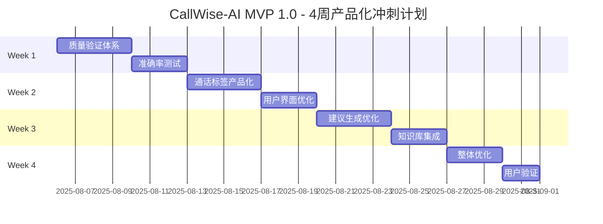

# CallWise-AI（销教通）激进4周MVP 1.0冲刺计划 🚀

## 🎯 产品愿景
通过AI技术赋能个人销售专业人士，提供智能对话分析、个性化辅导反馈和趋势追踪，让每位销售都拥有专属的AI教练，持续提升销售沟通能力和成交率。

## ⚡ 激进MVP 1.0目标 (4周)
**目标**：基于现有技术基础，在4周内完成产品化改进和质量验证，交付可用的MVP 1.0

### 🎯 MVP 1.0核心价值
- ✅ **已完成基础**：中继号语音获取→转写→AI总结（模块级功能已存在）
- 🔄 **质量验证**：验证转写准确率和异议识别准确率，建立测试体系
- 🚀 **产品化改进**：通话标签产品化展示，优化用户体验
- 📊 **建议优化**：基于Excel知识库的上下文建议生成优化
- 📱 **用户界面**：完善分析结果展示和用户交互体验

### 📊 成功指标 (MVP 1.0)

| 指标 | 目标值 | 验证方式 |
|------|--------|----------|
| 转写准确率验证 | 建立测试基准 | 人工标注+自动化测试 |
| 异议识别准确率验证 | 建立测试基准 | 人工标注+准确率计算 |
| 通话标签产品化 | 完整标签体系 | 用户体验测试 |
| 建议生成优化 | 基于知识库改进 | 建议质量评估 |
| 用户界面完善 | 直观易用 | 用户满意度≥4.0 |
| 系统稳定性 | 无重大bug | 功能测试通过 |

## 🎭 核心用户故事

### Epic 1: 智能录音分析
**作为** 家装维修技师，**我希望** 能在客户沟通后立即获得专业的话术分析和改进建议，**以便** 提升报价成功率和客户满意度。

### Epic 2: 持续能力提升
**作为** 个人销售专业人士，**我希望** 系统能追踪我的沟通能力变化趋势，**以便** 看到成长轨迹并持续改进。

### Epic 3: 智能跟进辅助
**作为** 销售人员，**我希望** 系统能基于通话分析智能推荐跟进策略和话术模板，**以便** 提高客户转化率。

---

## 🏃‍♂️ 4周激进冲刺计划

### 📅 总体时间线

---

## 🧪 Week 1: 质量验证体系建立 (Aug 6-12)

### 🎯 Week 1 目标
基于现有的中继号语音获取和AI转写分析能力，建立质量验证体系，测试转写和异议识别准确率。

### 📋 Sprint Backlog

#### 🔍 质量验证体系搭建 (4天)
**TEST-001: 转写准确率测试框架**
- **任务**: 建立转写准确率测试体系，收集测试语音样本
- **验收**: ≥100个真实通话样本，人工标注基准，自动化测试脚本
- **优先级**: P0 | **工作量**: 16h | **负责人**: 测试工程师

**TEST-002: 异议识别准确率测试**
- **任务**: 建立异议识别测试数据集，标注异议类型
- **验收**: ≥50个包含异议的通话样本，异议类型标注，准确率计算
- **优先级**: P0 | **工作量**: 14h | **负责人**: AI工程师

**TEST-003: 性能基准测试**
- **任务**: 测试现有系统的处理速度和稳定性
- **验收**: 响应时间统计，并发处理能力测试，错误率统计
- **优先级**: P1 | **工作量**: 10h | **负责人**: 测试工程师

#### 📊 准确率验证 (3天)
**VAL-001: 转写质量评估**
- **任务**: 执行转写准确率测试，分析错误类型
- **验收**: 转写准确率报告，错误分析，改进建议
- **优先级**: P0 | **工作量**: 12h | **负责人**: AI工程师

**VAL-002: 异议识别验证**
- **任务**: 验证异议识别功能的准确性
- **验收**: 异议识别准确率报告，混淆矩阵分析
- **优先级**: P0 | **工作量**: 10h | **负责人**: AI工程师

### ✅ Week 1 交付物
- [ ] 完整的质量测试体系
- [ ] 转写准确率基准报告
- [ ] 异议识别准确率基准报告
- [ ] 系统性能基准报告
- [ ] 质量改进建议清单

---

## 🏷️ Week 2: 通话标签产品化 + 界面优化 (Aug 13-19)

### 🎯 Week 2 目标
将现有的通话标签功能产品化，优化用户界面和交互体验，提升分析结果的可视化展示。

### 📋 Sprint Backlog

#### 🏷️ 通话标签产品化 (4天)
**TAG-001: 标签体系设计**
- **任务**: 设计完整的通话标签分类体系，标签优先级排序
- **验收**: 标签分类清单，标签展示规则，标签颜色编码
- **优先级**: P0 | **工作量**: 12h | **负责人**: 产品经理

**TAG-002: 标签可视化展示**
- **任务**: 设计标签在界面中的展示方式，支持筛选和排序
- **验收**: 直观的标签展示界面，支持标签筛选，标签统计
- **优先级**: P0 | **工作量**: 16h | **负责人**: 前端工程师

**TAG-003: 标签数据结构优化**
- **任务**: 优化标签数据存储和查询，提升标签生成效率
- **验收**: 标签数据模型，快速查询接口，标签缓存机制
- **优先级**: P1 | **工作量**: 10h | **负责人**: 后端工程师

#### 📱 用户界面优化 (3天)
**UI-001: 分析结果页面重设计**
- **任务**: 重新设计通话分析结果展示页面，突出关键信息
- **验收**: 清晰的信息层次，重要标签突出显示，易于理解
- **优先级**: P0 | **工作量**: 14h | **负责人**: UI设计师

**UI-002: 交互体验优化**
- **任务**: 优化用户操作流程，减少操作步骤，提升易用性
- **验收**: ≤3步完成主要操作，操作反馈及时，错误提示友好
- **优先级**: P0 | **工作量**: 12h | **负责人**: 前端工程师

**UI-003: 移动端适配优化**
- **任务**: 优化移动端显示效果，确保在不同屏幕尺寸下的体验
- **验收**: 响应式设计，移动端操作流畅，字体大小适中
- **优先级**: P1 | **工作量**: 8h | **负责人**: 前端工程师

### ✅ Week 2 交付物
- [ ] 完整的通话标签产品化方案
- [ ] 优化的标签可视化展示
- [ ] 重新设计的分析结果界面
- [ ] 改进的用户交互体验
- [ ] 移动端适配优化

---

## 💡 Week 3: 建议生成优化 + 知识库集成 (Aug 20-26)

### 🎯 Week 3 目标
优化基于Excel知识库的建议生成，改进上下文处理，提升建议质量和相关性。

### 📋 Sprint Backlog

#### 📚 知识库优化集成 (4天)
**KB-001: Excel知识库结构化处理**
- **任务**: 将Excel表格和文本知识库结构化，优化LLM上下文格式
- **验收**: 结构化知识数据，上下文模板优化，知识检索逻辑
- **优先级**: P0 | **工作量**: 14h | **负责人**: AI工程师

**KB-002: 上下文相关性优化**
- **任务**: 根据通话内容智能选择相关知识，减少无关信息干扰
- **验收**: 知识匹配算法，相关性评分，上下文长度控制
- **优先级**: P0 | **工作量**: 16h | **负责人**: AI工程师

**KB-003: 知识库版本管理**
- **任务**: 建立知识库更新机制，支持知识内容的增删改
- **验收**: 知识库版本控制，更新接口，变更日志
- **优先级**: P1 | **工作量**: 8h | **负责人**: 后端工程师

#### 🤖 建议生成优化 (3天)
**SUG-001: 建议生成质量提升**
- **任务**: 优化建议生成prompt，提升建议的针对性和可执行性
- **验收**: 建议质量评估，A/B测试对比，用户满意度提升
- **优先级**: P0 | **工作量**: 12h | **负责人**: AI工程师

**SUG-002: 建议分类和优先级**
- **任务**: 对生成的建议进行分类，设置优先级排序
- **验收**: 建议分类体系，优先级算法，建议排序展示
- **优先级**: P0 | **工作量**: 10h | **负责人**: 产品经理

**SUG-003: 建议效果跟踪**
- **任务**: 建立建议效果跟踪机制，收集用户反馈
- **验收**: 反馈收集界面，效果统计，建议改进循环
- **优先级**: P1 | **工作量**: 8h | **负责人**: 前端工程师

### ✅ Week 3 交付物
- [ ] 优化的知识库集成系统
- [ ] 改进的建议生成质量
- [ ] 建议分类和优先级体系
- [ ] 建议效果跟踪机制
- [ ] 知识库管理工具

---

## 🔧 Week 4: 整体优化 + 用户验证 (Aug 27 - Sep 2)

### 🎯 Week 4 目标
整体系统优化，进行用户验证测试，确保MVP 1.0达到发布标准。

### 📋 Sprint Backlog

#### 🔧 整体优化 (3天)
**OPT-001: 系统性能优化**
- **任务**: 优化系统响应速度，减少处理延迟，提升用户体验
- **验收**: 分析响应时间≤30秒，界面加载≤3秒，无明显卡顿
- **优先级**: P0 | **工作量**: 14h | **负责人**: 后端工程师

**OPT-002: 错误处理和异常管理**
- **任务**: 完善错误处理机制，友好的错误提示，异常恢复
- **验收**: 全面的错误捕获，用户友好的错误信息，自动重试机制
- **优先级**: P0 | **工作量**: 12h | **负责人**: 全栈工程师

**OPT-003: 数据一致性检查**
- **任务**: 检查数据完整性，修复数据不一致问题
- **验收**: 数据验证脚本，数据修复工具，数据质量报告
- **优先级**: P1 | **工作量**: 8h | **负责人**: 后端工程师

#### 👥 用户验证 (2天)
**VAL-001: 内部用户测试**
- **任务**: 邀请内部用户进行完整流程测试，收集反馈
- **验收**: ≥5个内部用户完成测试，反馈收集和分析，问题修复
- **优先级**: P0 | **工作量**: 10h | **负责人**: 产品经理

**VAL-002: 外部用户试用**
- **任务**: 邀请目标用户（家装维修技师）试用系统
- **验收**: ≥3个外部用户试用，用户满意度≥4.0，使用建议收集
- **优先级**: P0 | **工作量**: 8h | **负责人**: 产品经理

**VAL-003: 问题修复和优化**
- **任务**: 根据用户反馈快速修复问题，优化用户体验
- **验收**: 关键问题100%修复，用户建议评估和实施
- **优先级**: P0 | **工作量**: 12h | **负责人**: 开发团队

### ✅ Week 4 交付物
- [ ] 性能优化的MVP 1.0系统
- [ ] 完善的错误处理机制
- [ ] 用户验证测试报告
- [ ] 问题修复和优化清单
- [ ] MVP 1.0发布就绪确认

---

---

## 📈 MVP 1.0成功指标

### 技术指标

| 指标 | 目标值 | 当前值 | 验证方式 |
|------|--------|--------|----------|
| 语音转写准确率 | ≥95% | TBD | 自动化测试 |
| 异议识别准确率 | ≥80% | TBD | 人工标注验证 |
| 分析响应时间 | ≤30秒 | TBD | 性能监控 |
| 系统可用性 | ≥99% | TBD | 监控系统 |
| 移动端崩溃率 | ≤1% | TBD | 崩溃报告 |

### 用户指标

| 指标 | 目标值 | 当前值 | 验证方式 |
|------|--------|--------|----------|
| 用户完成率 | ≥80% | TBD | 用户行为分析 |
| 建议接受率 | ≥50% | TBD | 用户反馈统计 |
| 用户满意度 | ≥4.0/5 | TBD | 用户调研 |
| 日活跃率 | ≥40% | TBD | 用户行为分析 |
| 付费意向 | ≥30% | TBD | 用户调研 |

### 业务指标

| 指标 | 目标值 | 当前值 | 验证方式 |
|------|--------|--------|----------|
| 用户注册数 | ≥100 | TBD | 系统统计 |
| 录音分析次数 | ≥500 | TBD | 系统统计 |
| 建议生成数量 | ≥1500 | TBD | 系统统计 |
| 用户反馈数量 | ≥300 | TBD | 系统统计 |

---

**文档版本**: v2.0 - 激进4周冲刺计划
**创建日期**: 2025-08-06
**最后更新**: 2025-08-06
**下次评审**: 2025-08-13 (每周评审)

### 更新记录
- v2.1 (2025-08-06): **基于现有能力的4周产品化冲刺计划**
  - 基于已完成的中继号语音获取和AI分析能力
  - 重点关注质量验证、产品化改进和用户体验优化
  - 移除不适用的技术栈和风险管理部分
  - 针对通话标签产品化和建议生成优化
  - 强调用户验证和系统优化
- v2.0 (2025-08-06): 激进4周MVP 1.0冲刺计划
- v1.0 (2025-08-06): 初始版本，基础Sprint规划