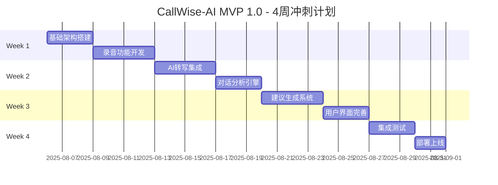

# CallWise-AI（销教通）激进4周MVP 1.0冲刺计划 🚀

## 🎯 产品愿景
通过AI技术赋能个人销售专业人士，提供智能对话分析、个性化辅导反馈和趋势追踪，让每位销售都拥有专属的AI教练，持续提升销售沟通能力和成交率。

## ⚡ 激进MVP 1.0目标 (4周)
**目标**：在4周内交付可用的MVP 1.0，包含完整的录音→分析→建议→跟进闭环

### 🎯 MVP 1.0核心价值
- ✅ **完整用户旅程**：录音→转写→分析→建议→跟进→统计
- ✅ **AI驱动分析**：≥95%转写准确率，≥80%异议识别准确率
- ✅ **即时反馈**：30秒内完成分析，生成≥3条可执行建议
- ✅ **持续学习**：用户反馈驱动的模型优化机制
- ✅ **移动优先**：iOS/Android原生体验，≤3步完成核心操作

### 📊 成功指标 (MVP 1.0)
| 指标 | 目标值 | 验证方式 |
|------|--------|----------|
| 转写准确率 | ≥95% | 自动化测试 |
| 异议识别准确率 | ≥80% | 人工标注验证 |
| 分析响应时间 | ≤30秒 | 性能监控 |
| 建议生成数量 | ≥3条/次 | 系统统计 |
| 用户完成率 | ≥80% | 用户行为分析 |
| 建议接受率 | ≥50% | 用户反馈统计 |

## 🎭 核心用户故事

### Epic 1: 智能录音分析
**作为** 家装维修技师，**我希望** 能在客户沟通后立即获得专业的话术分析和改进建议，**以便** 提升报价成功率和客户满意度。

### Epic 2: 持续能力提升
**作为** 个人销售专业人士，**我希望** 系统能追踪我的沟通能力变化趋势，**以便** 看到成长轨迹并持续改进。

### Epic 3: 智能跟进辅助
**作为** 销售人员，**我希望** 系统能基于通话分析智能推荐跟进策略和话术模板，**以便** 提高客户转化率。

---

## 🏃‍♂️ 4周激进冲刺计划

### 📅 总体时间线

---

## 🚀 Week 1: 基础架构 + 录音功能 (Aug 6-12)

### 🎯 Week 1 目标
建立技术基础架构，实现核心录音功能，为后续AI集成做准备。

### 📋 Sprint Backlog

#### 🏗️ 基础架构搭建 (3天)
**ARCH-001: 项目架构初始化**
- **任务**: 创建React Native项目，配置开发环境
- **验收**: iOS/Android项目可运行，CI/CD管道配置
- **优先级**: P0 | **工作量**: 8h | **负责人**: 架构师

**ARCH-002: 后端API框架搭建**
- **任务**: Node.js + Express API服务，数据库设计
- **验收**: RESTful API框架，PostgreSQL数据库，基础认证
- **优先级**: P0 | **工作量**: 12h | **负责人**: 后端工程师

**ARCH-003: AI服务基础架构**
- **任务**: Python FastAPI服务，Whisper集成准备
- **验收**: AI服务容器化，API接口定义，模型加载测试
- **优先级**: P0 | **工作量**: 10h | **负责人**: AI工程师

#### 📱 录音功能开发 (4天)
**REC-001: 移动端录音功能**
- **任务**: 实现一键录音，本地存储，音频格式处理
- **验收**: 支持iOS/Android录音，≤3步操作，离线存储
- **优先级**: P0 | **工作量**: 16h | **负责人**: 移动端工程师

**REC-002: 音频文件管理**
- **任务**: 文件上传，格式转换，云端同步
- **验收**: 支持mp3/wav/m4a，自动压缩，断点续传
- **优先级**: P0 | **工作量**: 12h | **负责人**: 移动端工程师

**REC-003: 录音界面设计**
- **任务**: 简洁录音界面，录音状态显示，操作反馈
- **验收**: Material Design规范，直观操作流程
- **优先级**: P1 | **工作量**: 8h | **负责人**: UI工程师

### ✅ Week 1 交付物
- [ ] 可运行的移动端应用框架
- [ ] 完整的后端API服务
- [ ] AI服务基础架构
- [ ] 功能完整的录音模块
- [ ] 基础的文件管理系统

---

## 🧠 Week 2: AI转写 + 对话分析 (Aug 13-19)

### 🎯 Week 2 目标
集成AI转写能力，实现对话分析和异议识别，建立评分体系。

### 📋 Sprint Backlog

#### 🎤 AI转写集成 (4天)
**AI-001: Whisper语音转写集成**
- **任务**: OpenAI Whisper API集成，中文优化配置
- **验收**: ≥95%中文转写准确率，支持方言，≤30秒响应
- **优先级**: P0 | **工作量**: 20h | **负责人**: AI工程师

**AI-002: 转写结果处理**
- **任务**: 文本清洗，时间戳对齐，说话人分离
- **验收**: 结构化转写结果，准确的时间轴标记
- **优先级**: P0 | **工作量**: 12h | **负责人**: AI工程师

**AI-003: 转写质量监控**
- **任务**: 转写质量评估，错误检测，置信度计算
- **验收**: 自动质量评分，低质量音频预警
- **优先级**: P1 | **工作量**: 8h | **负责人**: AI工程师

#### 🔍 对话分析引擎 (3天)
**ANA-001: 异议识别模型**
- **任务**: 基于BERT的异议类型识别，情感分析
- **验收**: ≥80%异议识别准确率，支持价格/质量/时间异议
- **优先级**: P0 | **工作量**: 16h | **负责人**: AI工程师

**ANA-002: 话术质量评分**
- **任务**: 专业度评分，问询质量，成交信号识别
- **验收**: 多维度评分体系，0-100分标准化输出
- **优先级**: P0 | **工作量**: 14h | **负责人**: AI工程师

**ANA-003: 关键时刻标记**
- **任务**: 对话关键节点识别，决策时刻检测
- **验收**: 自动标记异议点、成交信号、关键问题
- **优先级**: P1 | **工作量**: 10h | **负责人**: AI工程师

### ✅ Week 2 交付物
- [ ] 高精度语音转写服务
- [ ] 异议识别和分类系统
- [ ] 话术质量评分引擎
- [ ] 对话关键时刻标记功能
- [ ] 完整的分析结果数据结构

---

## 💡 Week 3: 建议生成 + 用户界面 (Aug 20-26)

### 🎯 Week 3 目标
实现智能建议生成，完善用户界面，建立用户反馈机制。

### 📋 Sprint Backlog

#### 🤖 建议生成系统 (4天)
**SUG-001: 行业知识库构建**
- **任务**: 家装维修行业知识库，RAG检索系统
- **验收**: ≥1000条专业知识，向量化存储，语义检索
- **优先级**: P0 | **工作量**: 16h | **负责人**: AI工程师

**SUG-002: 个性化建议生成**
- **任务**: 基于GPT的建议生成，模板化输出
- **验收**: ≥3条具体建议，个性化程度≥80%
- **优先级**: P0 | **工作量**: 18h | **负责人**: AI工程师

**SUG-003: 跟进策略推荐**
- **任务**: 智能跟进时机预测，话术模板推荐
- **验收**: 时机预测准确率≥70%，≥20个话术模板
- **优先级**: P1 | **工作量**: 12h | **负责人**: AI工程师

#### 📱 用户界面完善 (3天)
**UI-001: 分析结果展示界面**
- **任务**: Scorecard展示，建议列表，交互设计
- **验收**: 直观的评分展示，清晰的建议呈现
- **优先级**: P0 | **工作量**: 14h | **负责人**: 前端工程师

**UI-002: 用户反馈机制**
- **任务**: 建议评价按钮，反馈收集，学习循环
- **验收**: 一键反馈，反馈数据存储，模型更新触发
- **优先级**: P0 | **工作量**: 10h | **负责人**: 前端工程师

**UI-003: 跟进提醒功能**
- **任务**: 智能提醒设置，模板选择，发送跟进
- **验收**: 提醒准确性100%，模板使用率≥60%
- **优先级**: P1 | **工作量**: 8h | **负责人**: 前端工程师

### ✅ Week 3 交付物
- [ ] 完整的建议生成系统
- [ ] 行业专业知识库
- [ ] 用户友好的分析结果界面
- [ ] 用户反馈和学习机制
- [ ] 智能跟进提醒功能

---

## 📊 Week 4: 集成测试 + 部署上线 (Aug 27 - Sep 2)

### 🎯 Week 4 目标
完成系统集成，进行全面测试，部署MVP 1.0并准备用户验证。

### 📋 Sprint Backlog

#### 🧪 集成测试 (3天)
**TEST-001: 端到端功能测试**
- **任务**: 完整用户流程测试，性能压力测试
- **验收**: 所有核心功能正常，响应时间达标
- **优先级**: P0 | **工作量**: 16h | **负责人**: 测试工程师

**TEST-002: AI模型验证**
- **任务**: 转写准确率测试，建议质量评估
- **验收**: 达到设定的准确率指标，建议相关性验证
- **优先级**: P0 | **工作量**: 12h | **负责人**: AI工程师

**TEST-003: 用户体验测试**
- **任务**: 界面易用性测试，操作流程优化
- **验收**: ≤3步完成核心操作，用户满意度≥4.0
- **优先级**: P1 | **工作量**: 8h | **负责人**: 产品经理

#### 🚀 部署上线 (2天)
**DEPLOY-001: 生产环境部署**
- **任务**: 云服务配置，数据库迁移，监控设置
- **验收**: 稳定的生产环境，完整的监控体系
- **优先级**: P0 | **工作量**: 12h | **负责人**: DevOps工程师

**DEPLOY-002: 移动应用发布**
- **任务**: App Store/Google Play发布准备
- **验收**: 通过应用商店审核，可正常下载安装
- **优先级**: P0 | **工作量**: 8h | **负责人**: 移动端工程师

**DEPLOY-003: 用户文档和支持**
- **任务**: 用户手册，FAQ，客服支持准备
- **验收**: 完整的用户指南，响应式客服系统
- **优先级**: P1 | **工作量**: 6h | **负责人**: 产品经理

### ✅ Week 4 交付物
- [ ] 完全测试的MVP 1.0系统
- [ ] 稳定的生产环境部署
- [ ] 可下载的移动应用
- [ ] 完整的用户支持体系
- [ ] 数据监控和分析仪表板

---

## 🛠️ 技术栈确认

### 前端技术栈
- **移动端**: React Native (跨平台快速开发)
- **状态管理**: Redux Toolkit (可预测状态管理)
- **UI组件**: React Native Elements (快速UI开发)
- **导航**: React Navigation (原生导航体验)

### 后端技术栈
- **API服务**: Node.js + Express (快速开发，丰富生态)
- **数据库**: PostgreSQL (关系型数据，ACID特性)
- **缓存**: Redis (高性能缓存和会话管理)
- **文件存储**: AWS S3 (可靠的音频文件存储)

### AI技术栈
- **语音识别**: OpenAI Whisper API (≥95%中文准确率)
- **自然语言处理**: spaCy + transformers (对话分析)
- **建议生成**: GPT-3.5/4 API (智能建议生成)
- **知识检索**: ChromaDB + Sentence-BERT (RAG架构)

### DevOps技术栈
- **容器化**: Docker + Kubernetes (微服务部署)
- **CI/CD**: GitHub Actions (自动化部署)
- **监控**: Prometheus + Grafana (系统监控)
- **日志**: ELK Stack (日志分析)

---

## 🎯 风险管理与应对策略

### 🚨 高风险项目
| 风险项目 | 风险等级 | 影响 | 应对策略 |
|----------|----------|------|----------|
| AI转写准确率不达标 | 高 | 核心功能失效 | 备选方案：阿里云/腾讯云语音API |
| 开发进度延期 | 中 | 上线时间推迟 | 功能优先级调整，核心功能优先 |
| 用户接受度低 | 中 | 产品失败 | 快速用户反馈，敏捷迭代优化 |
| 技术债务积累 | 低 | 后期维护困难 | 代码审查，重构时间预留 |

### 🛡️ 质量保证措施
- **每日站会**: 跟踪进度，及时发现问题
- **代码审查**: 确保代码质量和一致性
- **自动化测试**: 单元测试覆盖率≥80%
- **用户测试**: 每周用户反馈收集
- **性能监控**: 实时系统性能跟踪

---

## 📈 MVP 1.0成功指标

### 技术指标
| 指标 | 目标值 | 当前值 | 验证方式 |
|------|--------|--------|----------|
| 语音转写准确率 | ≥95% | TBD | 自动化测试 |
| 异议识别准确率 | ≥80% | TBD | 人工标注验证 |
| 分析响应时间 | ≤30秒 | TBD | 性能监控 |
| 系统可用性 | ≥99% | TBD | 监控系统 |
| 移动端崩溃率 | ≤1% | TBD | 崩溃报告 |

### 用户指标
| 指标 | 目标值 | 当前值 | 验证方式 |
|------|--------|--------|----------|
| 用户完成率 | ≥80% | TBD | 用户行为分析 |
| 建议接受率 | ≥50% | TBD | 用户反馈统计 |
| 用户满意度 | ≥4.0/5 | TBD | 用户调研 |
| 日活跃率 | ≥40% | TBD | 用户行为分析 |
| 付费意向 | ≥30% | TBD | 用户调研 |

### 业务指标
| 指标 | 目标值 | 当前值 | 验证方式 |
|------|--------|--------|----------|
| 用户注册数 | ≥100 | TBD | 系统统计 |
| 录音分析次数 | ≥500 | TBD | 系统统计 |
| 建议生成数量 | ≥1500 | TBD | 系统统计 |
| 用户反馈数量 | ≥300 | TBD | 系统统计 |

---

## 🚀 MVP 1.0后续规划

### Phase 2: 智能化增强 (4-8周)
- 实时通话辅导功能
- 高级数据分析和预测
- 多行业知识库扩展
- 团队协作功能

### Phase 3: 商业化准备 (8-12周)
- 付费订阅系统
- 高级功能解锁
- 企业版功能开发
- 市场推广准备

---

**文档版本**: v2.0 - 激进4周冲刺计划
**创建日期**: 2025-08-06
**最后更新**: 2025-08-06
**下次评审**: 2025-08-13 (每周评审)

### 更新记录
- v2.0 (2025-08-06): **激进4周MVP 1.0冲刺计划**
  - 重新设计为4周激进冲刺计划
  - 详细的每周任务分解和工作量估算
  - 完整的技术栈确认和风险管理
  - 明确的成功指标和验证方式
  - 后续发展规划和商业化路径
- v1.0 (2025-08-06): 初始版本，基础Sprint规划