# CallWise-AI（销教通）前端设计文档 v1.0

## 🎯 设计概述

### 设计愿景
为个人销售专业人士打造直观、高效、智能的移动端AI教练体验，让复杂的AI分析结果变得易懂易用，让每次交互都能产生价值。

### 设计原则
- **移动优先**：专为移动端场景优化，支持单手操作
- **简洁直观**：≤3步完成核心操作，减少认知负担
- **数据可视化**：复杂数据简单化，一目了然
- **情感化设计**：通过视觉反馈增强用户成就感
- **行业化定制**：针对家装维修场景的专业化设计

## 🏗️ 信息架构与导航设计

### 应用信息架构

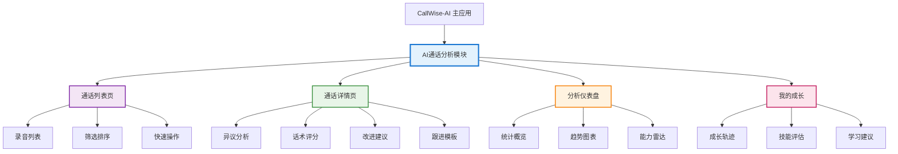

### 导航结构设计

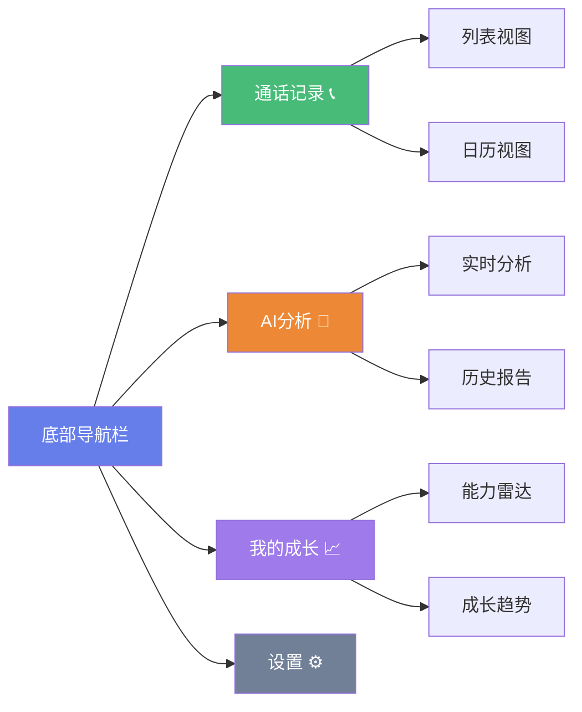

## 📱 核心页面设计

### 1. 通话列表页（模块入口）

#### 页面布局设计

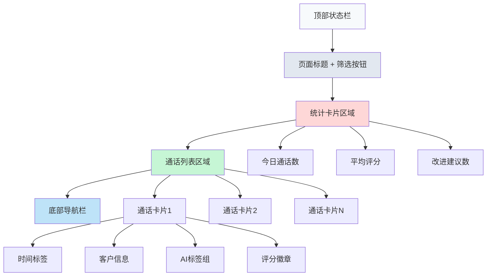

#### 关键设计元素

**统计卡片设计**：
- 今日通话数：大数字 + 环比变化
- 平均评分：进度条 + 分数显示
- 待处理建议：红点提醒 + 数量

**通话卡片设计**：
- 左侧：时间轴设计，显示通话时间
- 中间：客户信息 + 通话时长
- 右侧：AI分析标签 + 评分徽章
- 底部：快速操作按钮（查看详情、跟进客户）

### 2. 通话详情页（核心分析页面）

#### 页面结构设计

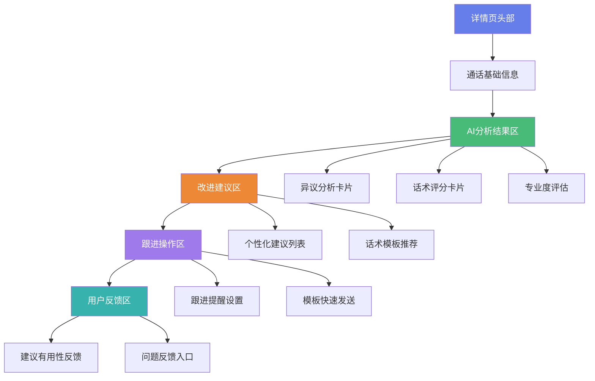

#### 异议分析卡片设计

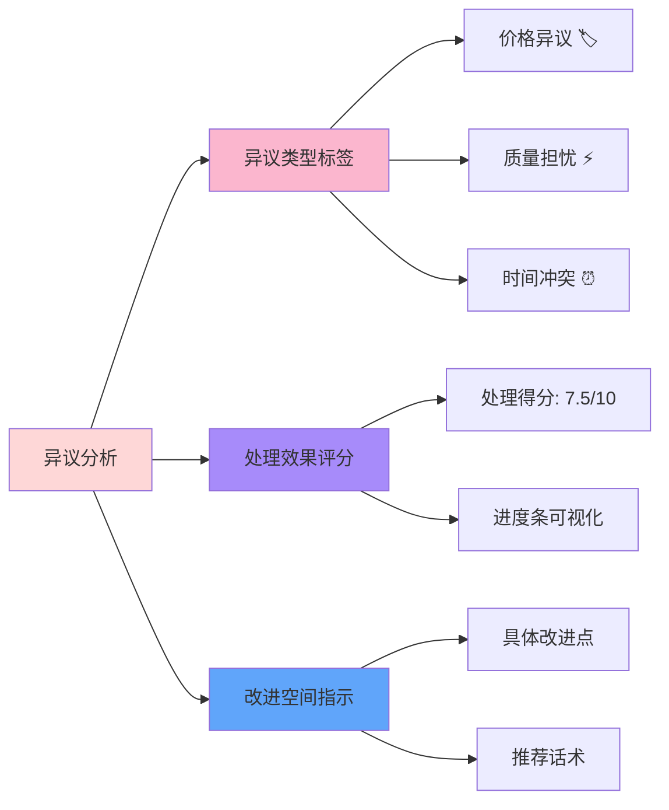

### 3. AI分析仪表盘页面

#### 仪表盘布局设计

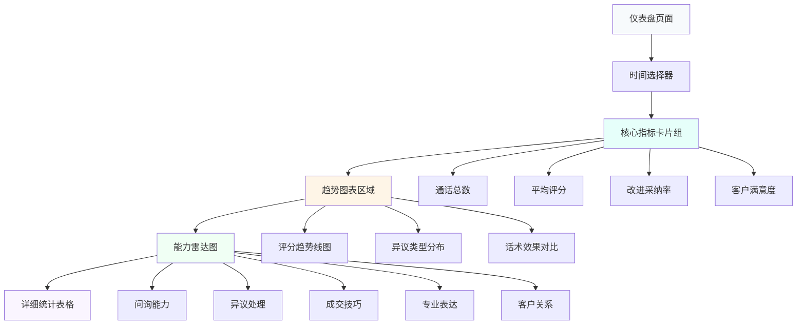

#### 数据可视化设计原则

**颜色系统**：
- 成功/正向：绿色系 (#48bb78)
- 警告/需改进：橙色系 (#ed8936)
- 错误/问题：红色系 (#f56565)
- 中性/信息：蓝色系 (#4299e1)

**图表类型选择**：
- 趋势数据：折线图
- 占比数据：环形图
- 对比数据：柱状图
- 能力评估：雷达图

## 🎨 视觉设计系统

### 设计语言

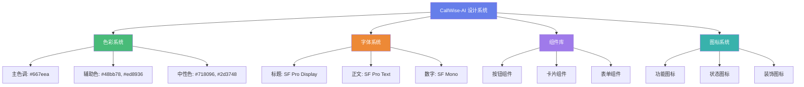

### 组件设计规范

**卡片组件**：
- 圆角：12px
- 阴影：0 4px 12px rgba(0,0,0,0.1)
- 内边距：16px
- 背景：白色 (#ffffff)

**按钮组件**：
- 主按钮：蓝色背景，白色文字，圆角8px
- 次要按钮：透明背景，蓝色边框，蓝色文字
- 危险按钮：红色背景，白色文字

**状态标签**：
- 成功：绿色背景，深绿色文字
- 警告：橙色背景，深橙色文字
- 错误：红色背景，白色文字

## 🔄 交互流程设计

### 核心用户流程

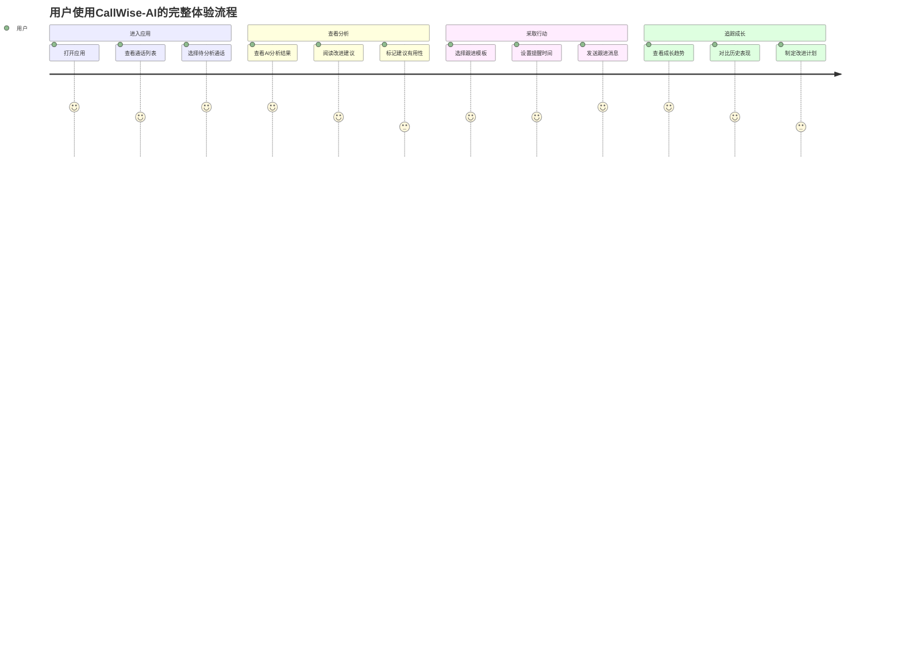

### 关键交互设计

**下拉刷新**：
- 在通话列表页支持下拉刷新
- 显示刷新动画和状态提示
- 自动同步最新的AI分析结果

**无限滚动**：
- 通话列表支持无限滚动加载
- 显示加载状态和加载完成提示
- 优化大数据量的性能表现

**手势操作**：
- 左滑通话卡片显示快速操作
- 长按卡片进入多选模式
- 双击放大图表查看详情

## 📊 响应式设计

### 屏幕适配策略

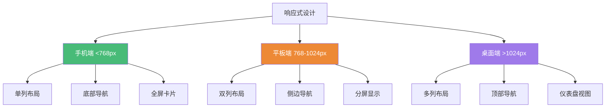

### 移动端优化

**触摸优化**：
- 按钮最小尺寸：44px × 44px
- 间距设计：至少8px间隔
- 手势友好：支持常用手势操作

**性能优化**：
- 图片懒加载
- 虚拟滚动
- 组件按需加载
- 缓存策略优化

## 🎯 用户体验设计

### 情感化设计

**成就系统**：
- 评分提升时显示庆祝动画
- 里程碑达成时弹出成就徽章
- 连续使用奖励机制

**引导系统**：
- 首次使用的分步引导
- 新功能的气泡提示
- 空状态的友好提示

**反馈系统**：
- 操作成功的即时反馈
- 加载状态的进度指示
- 错误状态的友好提示

### 可访问性设计

**视觉可访问性**：
- 颜色对比度符合WCAG标准
- 支持大字体显示
- 重要信息不仅依赖颜色传达

**操作可访问性**：
- 支持语音朗读
- 键盘导航支持
- 手势操作替代方案

## 🔧 技术实现指南

### React Native组件架构

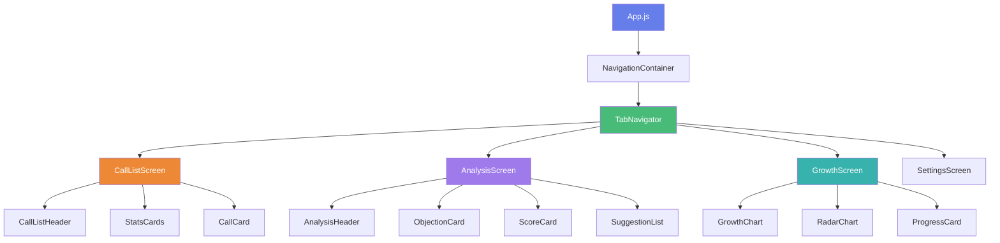

### 状态管理设计

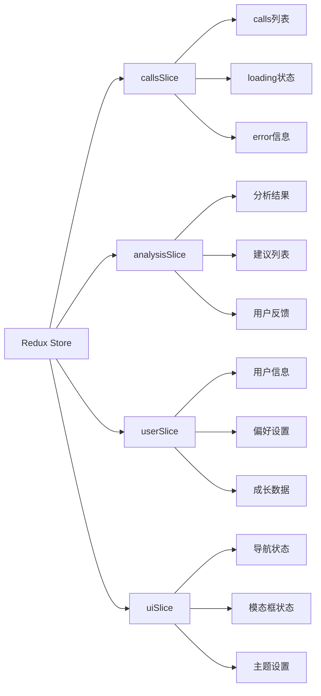

### 关键组件设计规范

**CallCard组件**：
```javascript
// 通话卡片组件设计
<CallCard>
  <TimeStamp />
  <CustomerInfo />
  <AITags />
  <ScoreBadge />
  <QuickActions />
</CallCard>
```

**AnalysisCard组件**：
```javascript
// 分析卡片组件设计
<AnalysisCard>
  <CardHeader />
  <ScoreVisualization />
  <KeyInsights />
  <ActionButtons />
</AnalysisCard>
```

## 📋 详细页面规格

### 通话详情页完整设计

#### 页面头部设计
- **返回按钮**：左上角，支持手势返回
- **通话标题**：客户姓名 + 通话时间
- **操作菜单**：右上角三点菜单（分享、删除、标记）

#### 分析结果展示区

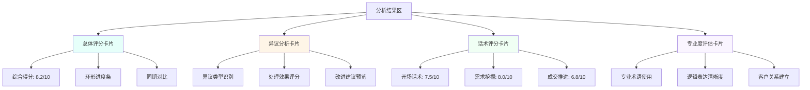

#### 改进建议区设计

**建议卡片结构**：
- **优先级标识**：高/中/低优先级颜色标识
- **建议标题**：简洁明了的改进点
- **具体描述**：详细的改进方法和话术示例
- **相关模板**：推荐的话术模板链接
- **用户反馈**：👍/👎 反馈按钮

### 成长追踪页面设计

#### 能力雷达图设计

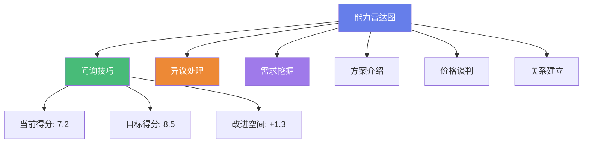

#### 成长趋势图设计

**时间维度选择**：
- 最近7天
- 最近30天
- 最近3个月
- 自定义时间范围

**指标展示**：
- 综合评分趋势线
- 各维度能力变化
- 里程碑标记点
- 目标达成进度

## 🎨 动效与微交互设计

### 页面转场动效

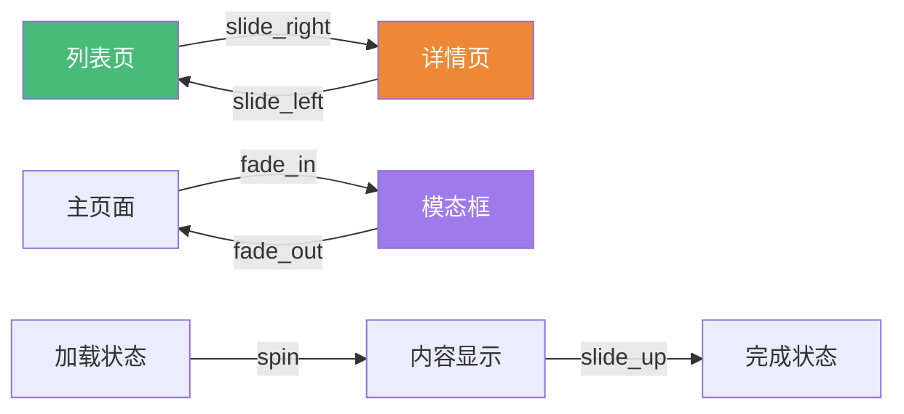

### 微交互设计

**按钮交互**：
- 点击时轻微缩放效果（scale: 0.95）
- 加载状态显示旋转动画
- 成功状态显示对勾动画

**卡片交互**：
- 悬停时轻微上浮效果
- 点击时边框高亮
- 展开时平滑动画过渡

**数据更新动效**：
- 数字变化时的计数动画
- 图表数据更新的过渡动画
- 新内容出现的淡入效果

## 📱 移动端特定设计

### 手势操作设计

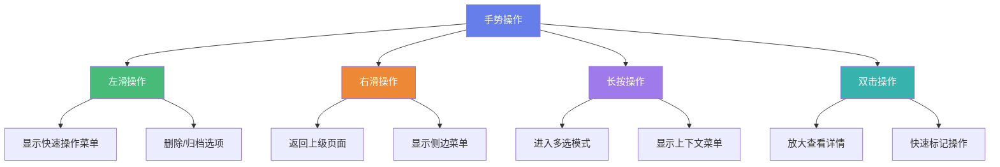

### 触摸优化设计

**触摸目标尺寸**：
- 主要按钮：最小48dp × 48dp
- 次要按钮：最小44dp × 44dp
- 文字链接：最小44dp × 44dp
- 图标按钮：最小48dp × 48dp

**间距设计**：
- 相邻可点击元素间距：≥8dp
- 卡片内边距：16dp
- 页面边距：16dp
- 组件间距：12dp

### 键盘适配设计

**输入框设计**：
- 自动聚焦时页面上移
- 键盘遮挡时内容滚动
- 输入完成时自动收起键盘
- 支持键盘快捷操作

## 🔍 用户测试与优化

### A/B测试计划

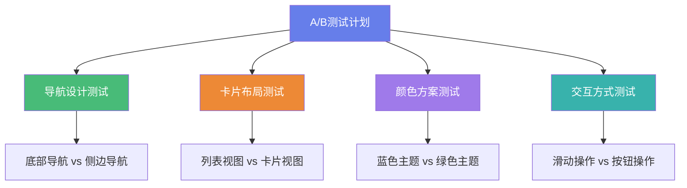

### 用户反馈收集

**反馈收集点**：
- 功能使用后的满意度评分
- 页面加载速度体验反馈
- 操作流程便利性评价
- 视觉设计喜好调研

**优化迭代流程**：
1. 收集用户反馈数据
2. 分析用户行为热力图
3. 识别问题和改进点
4. 设计优化方案
5. 小范围测试验证
6. 全量发布优化版本

## 📊 性能优化设计

### 加载性能优化

**分层加载策略**：
- 首屏内容优先加载
- 图片懒加载
- 非关键内容延迟加载
- 预加载下一页内容

**缓存策略**：
- 静态资源本地缓存
- API数据智能缓存
- 图片缓存管理
- 离线数据支持

### 渲染性能优化

**组件优化**：
- 使用React.memo减少重渲染
- 虚拟列表处理大数据
- 图表组件按需渲染
- 动画使用原生驱动

---

**文档版本**: v1.0
**创建日期**: 2025-08-06
**最后更新**: 2025-08-06
**下次评审**: 2025-08-20

### 更新记录
- v1.0 (2025-08-06): 初始版本，完整的前端设计文档
