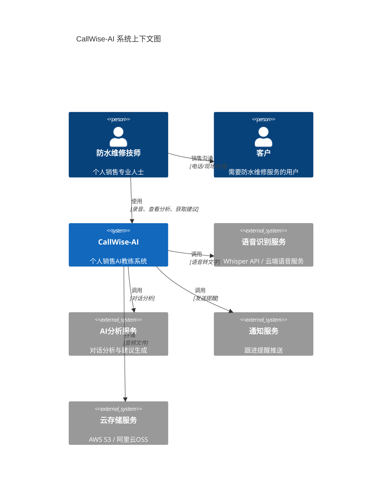
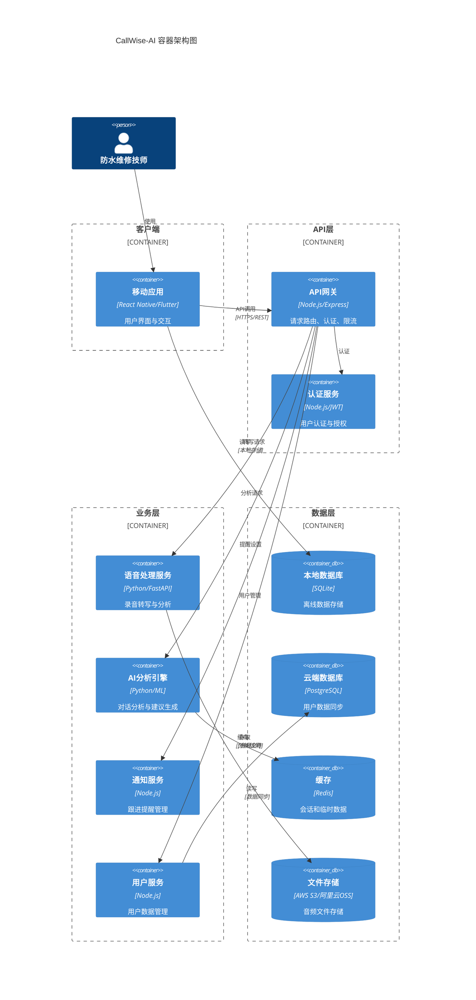
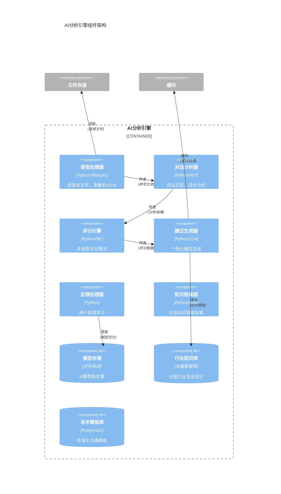
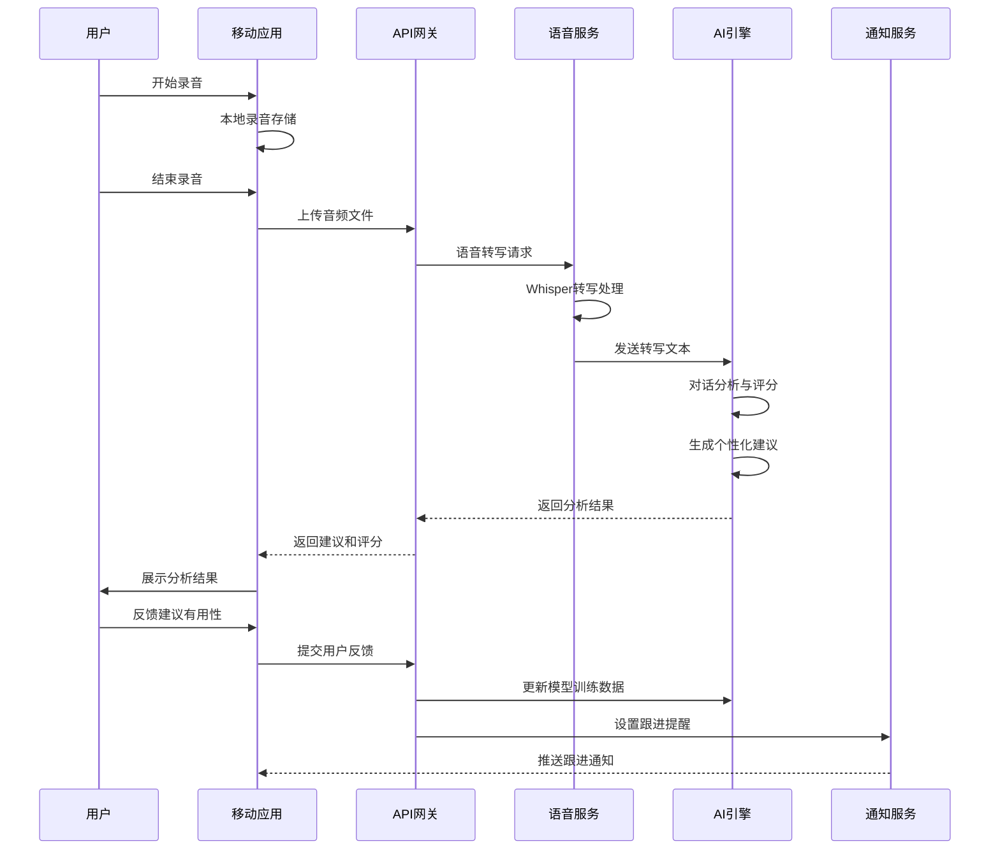
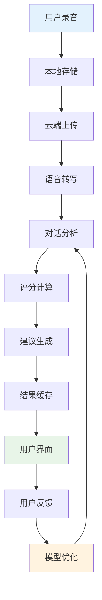
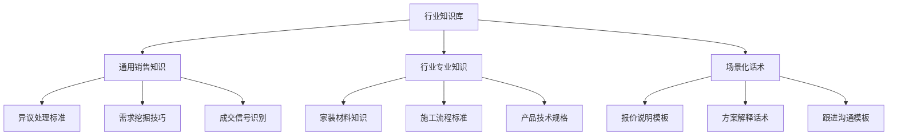
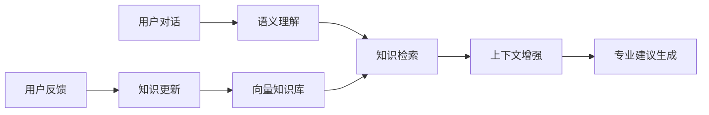
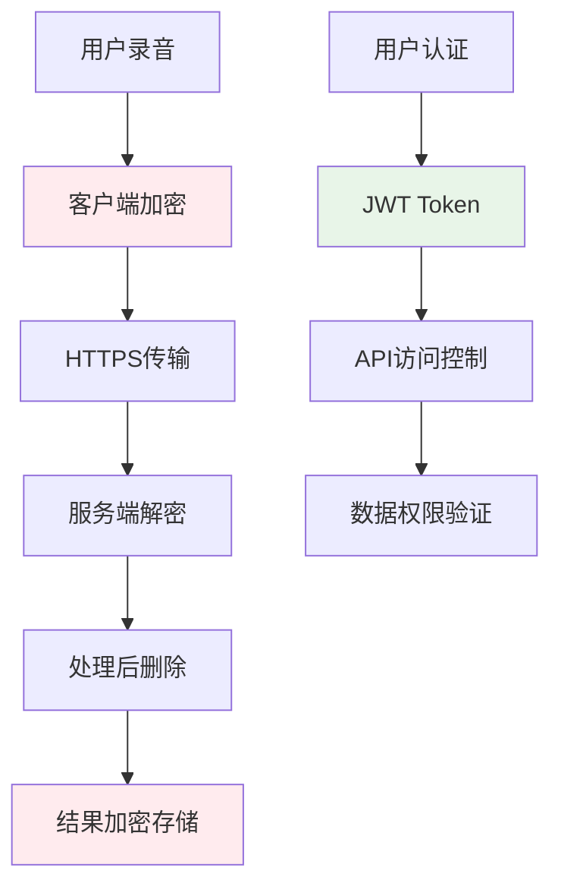
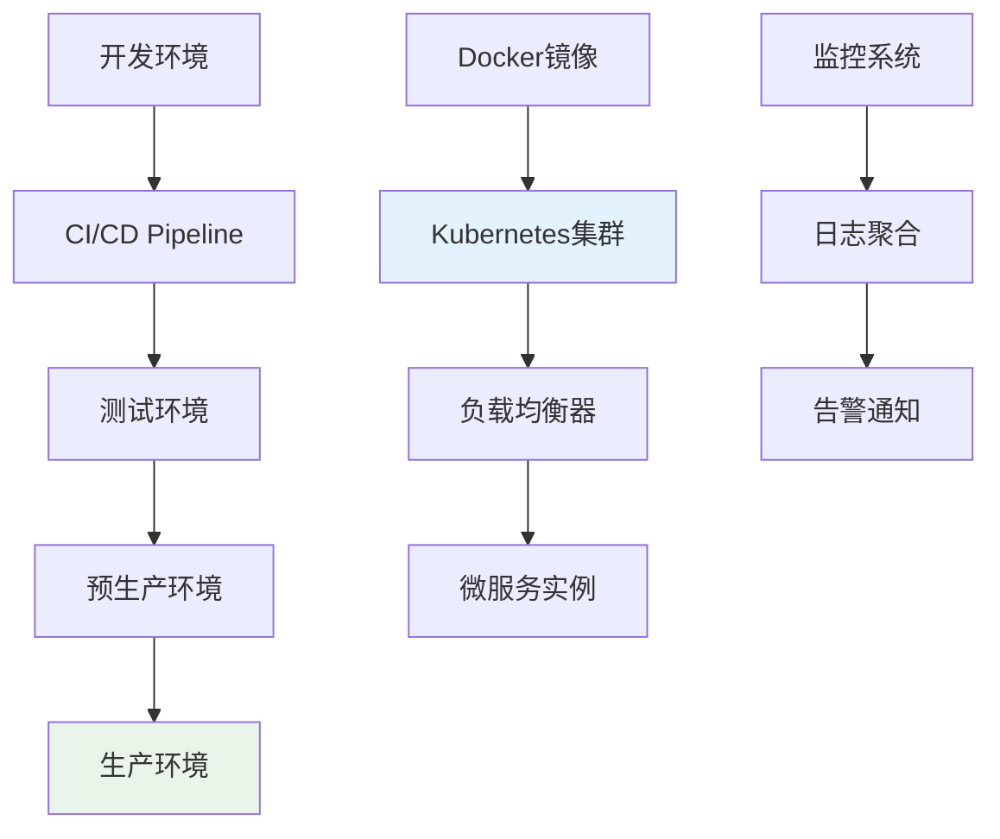

# CallWise-AI（销教通）系统架构设计 v2.0

## 📋 架构概述

CallWise-AI采用**微服务架构**和**移动优先**的设计理念，为个人销售专业人士提供AI驱动的销售辅导服务。系统遵循**敏捷开发**原则，支持快速迭代和横向扩展。

### 架构原则
- **移动优先**：核心功能优先考虑移动端体验
- **离线优先**：支持离线录音和本地存储
- **API优先**：所有功能通过RESTful API提供
- **数据安全**：端到端加密，符合隐私法规
- **可扩展性**：模块化设计，支持功能扩展

## 🏗️ C4架构模型

### Level 1: 系统上下文图



### Level 2: 容器架构图



### Level 3: 核心组件架构



## 🔄 数据流与业务流程

### 核心业务流程



### 数据流架构



## 🛠️ 技术栈与实现

### 前端技术栈

| 组件 | 技术选型 | 理由 |
|------|----------|------|
| 移动框架 | React Native | 跨平台开发，快速迭代 |
| 状态管理 | Redux Toolkit | 可预测的状态管理 |
| 本地存储 | SQLite + AsyncStorage | 离线支持，轻量级 |
| 音频处理 | react-native-audio-recorder | 原生音频录制能力 |
| 图表组件 | Victory Native | 数据可视化 |

### 后端技术栈

| 组件 | 技术选型 | 理由 |
|------|----------|------|
| API网关 | Node.js + Express | 轻量级，快速开发 |
| 语音服务 | Python + FastAPI | AI/ML生态丰富 |
| AI引擎 | Python + PyTorch | 深度学习框架 |
| 数据库 | PostgreSQL | 关系型数据，ACID特性 |
| 缓存 | Redis | 高性能缓存 |
| 消息队列 | Redis Pub/Sub | 异步处理 |

### AI/ML技术栈

| 组件 | 技术选型 | 版本要求 |
|------|----------|----------|
| 语音识别 | OpenAI Whisper | v3+ |
| 自然语言处理 | spaCy + transformers | 最新稳定版 |
| 对话分析 | 自训练BERT模型 | 中文优化 |
| 建议生成 | GPT-3.5/4 API | 备选本地LLM |
| 知识检索 | ChromaDB + Sentence-BERT | RAG架构 |
| 向量化 | text-embedding-ada-002 | OpenAI嵌入模型 |

## 🧠 行业知识库架构

### 知识库分层设计



### RAG增强生成流程



### 知识库实现策略

| 组件 | 技术选型 | 用途 |
|------|----------|------|
| 向量数据库 | ChromaDB | 语义检索 |
| 检索算法 | 混合检索(语义+关键词) | 提高召回率 |
| 知识更新 | 增量学习 | 持续优化 |
| 质量控制 | 专家审核+用户反馈 | 确保准确性 |

## 🔒 安全与隐私设计

### 数据安全架构



### 隐私保护措施
- **端到端加密**：音频文件在客户端加密，服务端处理后立即删除
- **数据最小化**：只收集必要的业务数据
- **匿名化处理**：用户反馈数据去标识化
- **合规认证**：符合GDPR、CCPA、个保法要求
- **用户控制**：支持数据导出和删除

## 📊 性能与可扩展性

### 性能指标

| 指标 | 目标值 | 监控方式 |
|------|--------|----------|
| 语音转写准确率 | ≥95% | 自动化测试 |
| API响应时间 | ≤30秒 | APM监控 |
| 系统可用性 | ≥99.5% | 健康检查 |
| 并发用户数 | 1000+ | 负载测试 |

### 扩展策略
- **水平扩展**：微服务架构，独立扩展
- **缓存策略**：多层缓存，减少计算负载
- **CDN加速**：静态资源和音频文件分发
- **数据库优化**：读写分离，分库分表

## 🚀 部署与运维

### 部署架构



### 运维策略
- **容器化部署**：Docker + Kubernetes
- **自动化运维**：GitOps + ArgoCD
- **监控告警**：Prometheus + Grafana
- **日志管理**：ELK Stack
- **备份策略**：自动化数据备份和恢复

## 📈 监控与分析

### 业务指标监控
```mermaid
dashboard
    title CallWise-AI 业务监控仪表盘

    metric "日活用户" {
        value 1250
        trend up
    }

    metric "录音转写成功率" {
        value 96.8%
        trend stable
    }

    metric "AI建议接受率" {
        value 52.3%
        trend up
    }

    metric "平均响应时间" {
        value 18s
        trend down
    }
```

### 技术指标追踪
- **用户行为**：录音频次、功能使用率、留存率
- **系统性能**：响应时间、错误率、资源使用率
- **AI模型**：准确率、置信度、用户满意度
- **业务转化**：免费转付费、功能采用率

---

**文档版本**: v2.0
**创建日期**: 2025-08-06
**最后更新**: 2025-08-06
**下次评审**: 2025-09-06

### 更新记录
- v2.0 (2025-08-06): **完整重构架构设计**
  - 引入C4模型进行系统架构设计
  - 完善技术栈选型和实现细节
  - 增强安全与隐私保护设计
  - 添加性能指标和扩展策略
  - 完善部署运维和监控方案
- v1.0 (2025-08-06): 初始版本