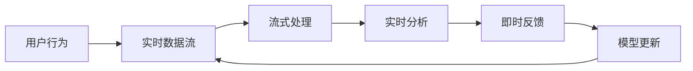
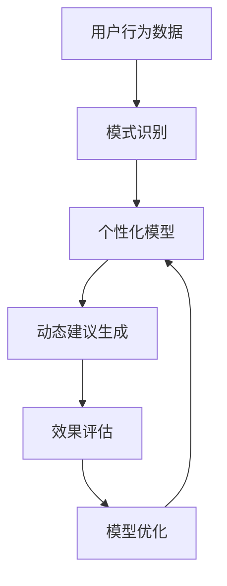
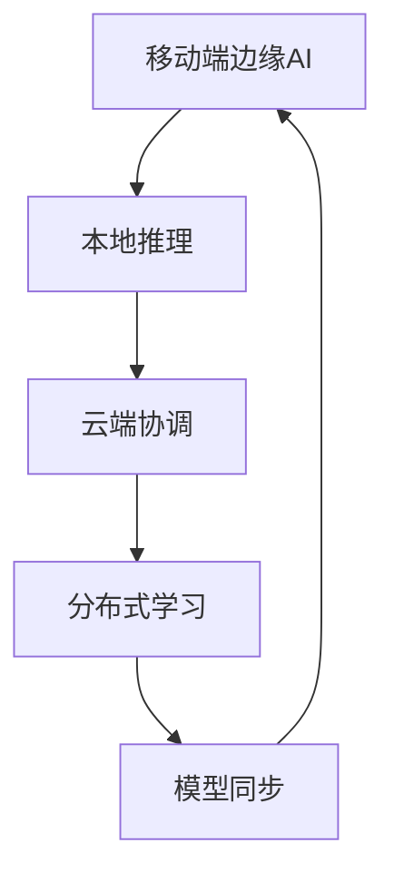
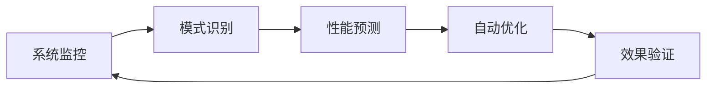

# CallWise-AI（销教通）AI Native升级规划 v1.0

## 📋 AI Native评审概述

基于对全球AI Native应用发展趋势的深入研究，CallWise-AI在向真正AI Native应用演进的道路上具备良好基础，但仍需要在关键维度上进行系统性升级。

### AI Native核心理念
- **深度集成**：AI作为系统DNA，而非附加功能
- **数据优先**：数据作为一等公民，持续学习管道
- **分布式智能**：去中心化的智能架构
- **智能编排**：自主代理和工作流协调
- **持续自适应**：实时反馈和自进化能力

## 🎯 当前AI Native成熟度评估

| 维度 | 当前得分 | AI Native目标 | 关键差距 |
|------|----------|---------------|----------|
| **设计维度** | 7/10 | 9/10 | 需要动态化、自适应UI |
| **数据维度** | 4/10 | 9/10 | **关键差距：缺乏实时数据流** |
| **领域知识维度** | 8/10 | 9/10 | 知识自动化更新机制 |
| **动态维度** | 3/10 | 9/10 | **关键差距：缺乏自进化能力** |
| **分布维度** | 5/10 | 8/10 | 边缘智能能力不足 |
| **总体成熟度** | **5.4/10** | **8.8/10** | **需要系统性升级** |

### 🔍 关键发现

**✅ 现有优势**
- AI-First产品设计理念清晰
- 行业知识库和RAG架构体现专业知识嵌入
- 基础的用户反馈和模型优化机制

**⚠️ 关键不足**
- **数据架构**：批处理模式，缺乏实时数据流和持续学习
- **智能编排**：传统API调用链，缺乏智能代理协调
- **自进化能力**：依赖人工干预，缺乏自主优化
- **分布式智能**：云端集中式，缺乏边缘智能

## 🚀 AI Native升级路线图

### Phase 1: 数据架构现代化 (3-6个月)
**目标：建立AI Native数据基础**

#### 1.1 实时数据流管道

**关键任务：**
- 替换批处理为流式数据处理（Apache Kafka + Flink）
- 实现实时用户行为分析和模式识别
- 建立实时数据质量监控和异常检测
- 设计数据血缘追踪和自动化治理框架

#### 1.2 持续学习基础设施
- 在线学习和模型自动更新机制
- A/B测试框架用于模型迭代验证
- 用户行为驱动的个性化学习算法

**预期成果：**
- 数据维度得分提升至 7/10
- 用户反馈到模型优化延迟从天级降至分钟级
- 个性化建议准确率提升20%

### Phase 2: 智能个性化升级 (6-9个月)
**目标：实现深度个性化和预测性分析**

#### 2.1 智能个性化引擎

**关键任务：**
- 构建用户行为分析和模式识别系统
- 实现基于历史数据的个性化建议算法
- 开发预测性分析能力（预测最佳沟通时机）
- 建立自适应的用户界面和功能推荐

#### 2.2 智能工作流优化
- 根据用户使用习惯优化分析流程
- 智能的功能推荐和引导系统
- 基于效果反馈的自动化A/B测试

**预期成果：**
- 动态维度得分提升至 6/10
- 建议接受率提升40%
- 用户满意度提升25%

### Phase 3: 分布式智能 (9-12个月)
**目标：实现边缘-云协同的分布式智能**

#### 3.1 边缘-云协同架构

**关键任务：**
- 在移动端部署轻量级AI推理模型
- 设计智能的云-边缘任务分配策略
- 实现离线场景下的核心智能功能
- 建立联邦学习机制保护用户隐私

#### 3.2 跨环境一致性
- 统一的智能能力API接口
- 跨设备的用户体验一致性
- 智能的数据同步和冲突解决

**预期成果：**
- 分布维度得分提升至 8/10
- 离线场景功能可用性达到80%
- 响应延迟降低50%

### Phase 4: 高级智能功能 (12-18个月)
**目标：引入高级AI功能和智能协作**

#### 4.1 预测性系统优化

**关键任务：**
- 实现基于使用模式的性能预测
- 建立自动化的系统调优机制
- 设计故障预测和自愈能力
- 开发零接触的配置管理

#### 4.2 智能协作功能（可选）
- 实时通话辅导功能
- 复杂场景的多模型协作
- 高度个性化的学习路径规划
- 智能代理架构（仅在业务复杂度足够时考虑）

**预期成果：**
- 动态维度得分提升至 9/10
- 系统运维成本降低60%
- 支持更复杂的业务场景

## 📊 投资回报分析

### 技术投资
| 阶段 | 投资金额 | 主要用途 | 预期ROI |
|------|----------|----------|---------|
| Phase 1 | $200K | 数据基础设施 | 150% |
| Phase 2 | $180K | 个性化引擎开发 | 200% |
| Phase 3 | $250K | 边缘智能部署 | 180% |
| Phase 4 | $150K | 高级智能功能 | 220% |
| **总计** | **$780K** | **18个月** | **平均185%** |

### 商业价值
- **用户留存率**：预期提升50%（从40%到60%）
- **付费转化率**：预期提升100%（从15%到30%）
- **用户满意度**：预期提升40%（从4.0到5.6分）
- **市场竞争力**：成为真正的AI Native产品，建立技术护城河

## 🎯 成功指标与里程碑

### Phase 1 里程碑
- [ ] 实时数据流管道上线
- [ ] 持续学习机制验证
- [ ] 个性化准确率提升20%

### Phase 2 里程碑
- [ ] 个性化引擎部署
- [ ] 预测性分析功能验证
- [ ] 建议接受率提升40%

### Phase 3 里程碑
- [ ] 边缘AI功能发布
- [ ] 联邦学习机制验证
- [ ] 离线功能可用性80%

### Phase 4 里程碑
- [ ] 高级智能功能上线
- [ ] 零接触运维实现
- [ ] 支持复杂业务场景

## 🤔 关于Agent架构的说明

### 为什么不在早期引入Agent？

**Agent架构适用场景**：
- 复杂多步骤决策场景
- 实时交互和协作需求
- 高度个性化的处理逻辑

**CallWise-AI的实际情况**：
- MVP阶段业务逻辑相对简单（录音→分析→建议）
- 用户群体需求相对同质（销售技能提升）
- 处理流程相对固定

**结论**：Agent架构在Phase 4作为可选的高级功能，只有在业务复杂度足够高时才考虑引入。

## 🔄 风险评估与缓解策略

### 技术风险
- **风险**：AI Native架构复杂度高
- **缓解**：分阶段实施，每个阶段充分验证，避免过度设计

### 资源风险
- **风险**：技术团队能力要求提升
- **缓解**：提前进行团队培训和人才引进

### 市场风险
- **风险**：用户对高级AI功能接受度不确定
- **缓解**：通过A/B测试和用户反馈持续优化

## 📋 下一步行动

### 立即执行（本月内）
1. **技术调研**：深入研究AI Native技术栈
2. **团队评估**：评估现有团队AI Native开发能力
3. **预算规划**：制定详细的投资预算和时间表

### 短期目标（3个月内）
1. **Phase 1启动**：开始数据架构现代化改造
2. **人才引进**：招聘AI Native架构师和数据工程师
3. **技术验证**：完成关键技术的POC验证

---

**文档版本**: v1.0
**创建日期**: 2025-08-06
**最后更新**: 2025-08-06
**下次评审**: 2025-09-06

### 更新记录
- v1.0 (2025-08-06): 基于AI Native评审结果创建升级规划文档
