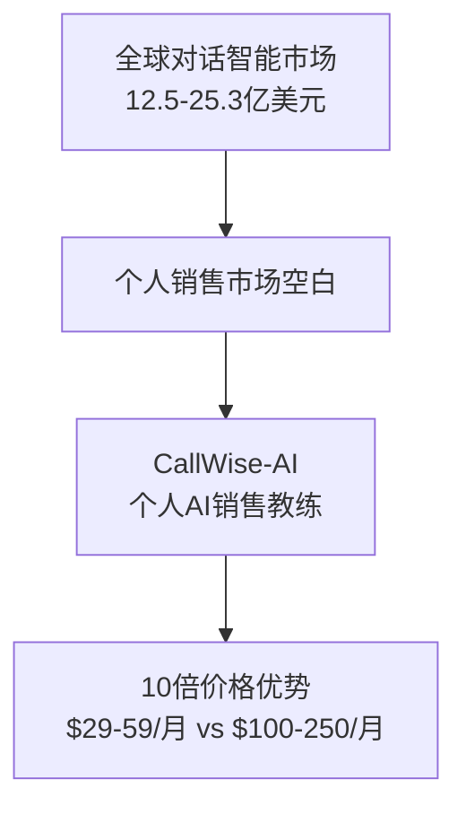

# MVP设计文档更新总结

## 📊 **更新概览**

基于机会分析v1.4的最新市场数据，对MVP设计文档进行了全面更新，并引入Mermaid图表实现可视化优化。

## ✅ **核心更新内容**

### 1. **产品定位保持不变**
- **确认**：个人销售专业人士的AI教练定位不变
- **重点目标用户**：家装维修技师（已在远程更新中确定）
- **核心价值**：通过对话评分、个性化反馈与趋势追踪提升销售能力

### 2. **基于机会分析的关键调整**

#### **技术标准提升**
- 语音识别准确率：从90%提升至**95%**（中文语音识别新标准）
- 对标竞品：超越行业90%标准，确保技术领先

#### **竞争优势强化**
- 突出**10倍价格优势**：$29-59/月 vs 竞品$100-250/月
- 基于全球对话智能市场12.5-25.3亿美元规模，验证市场潜力
- 66%销售团队AI采用率，证明市场需求强劲

#### **市场定位精准化**
- 明确个人销售市场空白机会
- 强调中文本土化和轻量级部署优势

## 🎨 **Mermaid可视化改进**

### **新增的关键图表**

#### 1. **产品愿景与市场机会图**

#### 2. **用户画像和价值主张图**
- 可视化展示目标用户群体
- 清晰表达用户痛点和解决方案

#### 3. **用户使用流程图**
- 完整展示从录音到反馈的全流程
- 突出95%转写准确率等关键指标

#### 4. **市场趋势分析图**（机会分析文档）
- 可视化展示AI采用加速、个人市场空白等关键趋势

## 📈 **文档质量提升**

### **可视化效果**
- **信息密度提升**：图表传递更多信息，减少文字冗余
- **理解效率提高**：结构化图示胜过万语千言
- **专业性增强**：现代化的可视化表达方式

### **内容优化**
- **数据驱动**：基于最新市场数据更新所有关键指标
- **逻辑清晰**：通过图表明确展示产品逻辑和市场机会
- **重点突出**：可视化强调核心竞争优势

## 🎯 **MVP设计的关键改进**

### **功能优先级更新**
基于市场分析，确认MVP核心功能：
1. **录音/上传功能**（Must Have）
2. **语音转写≥95%**（技术标准提升）
3. **AI评分系统**（核心差异化）
4. **个性化建议**（价值核心）
5. **用户反馈机制**（持续改进）
6. **趋势仪表板**（用户粘性）

### **验收标准更新**
- 语音转写准确率：≥95%（vs 原90%）
- 系统响应时间：≤30秒
- 用户操作步骤：≤3步
- 系统稳定性：≥99%

### **风险缓解策略**
- 针对API依赖风险增加备选方案
- 强化数据合规要求（GDPR、个保法）
- 用户体验简化策略

## 📊 **商业模式验证**

### **定价策略确认**
基于竞品分析，确认定价优势：
- **个人版**：$29/月
- **专业版**：$59/月  
- **团队版**：$99/月

### **市场机会量化**
- 全球对话智能市场：12.5-25.3亿美元
- 个人市场空白：企业级产品主导，个人用户未覆盖
- 价格优势：10倍差距创造显著竞争力

## 🚀 **下一步行动计划**

### **立即执行**（本周）
1. **用户访谈**：验证家装维修技师的具体需求
2. **技术验证**：测试中文语音识别95%准确率可行性
3. **竞品深度分析**：体验Gong、Avoma等产品最新功能

### **短期目标**（2-4周）
1. **MVP原型设计**：基于更新的需求设计界面原型
2. **技术架构细化**：制定详细的技术实现方案
3. **Beta用户招募**：寻找5-10名目标用户进行测试

### **中期规划**（1-3个月）
1. **MVP开发**：按照更新的标准开发核心功能
2. **市场验证**：通过Beta测试验证产品市场匹配度
3. **商业化准备**：完善定价策略和商业模式

## 📋 **文档结构优化成果**

### **机会分析文档**
- ✅ 添加市场趋势可视化图表
- ✅ 补充全球市场规模数据
- ✅ 强化竞品对比分析

### **MVP设计文档**
- ✅ 重构为v2.0版本
- ✅ 引入Mermaid图表系统
- ✅ 基于最新数据更新所有指标
- ✅ 保持产品定位一致性

## 🎉 **总结**

通过这次更新，我们实现了：

1. **数据驱动的决策**：基于客观市场数据更新MVP设计
2. **可视化表达**：用图表替代大量文字，提升信息传递效率
3. **竞争优势明确**：突出10倍价格优势和技术领先性
4. **产品定位一致**：保持个人销售AI教练的核心定位
5. **执行标准提升**：技术和商业指标更加精准

MVP设计现在更加客观、可视化和可执行，为后续开发提供了清晰的指导方向。

---

**更新完成时间**: 2025-08-06  
**文档版本**: MVP v2.0, 机会分析 v1.4  
**主要贡献**: 可视化优化 + 数据驱动更新
