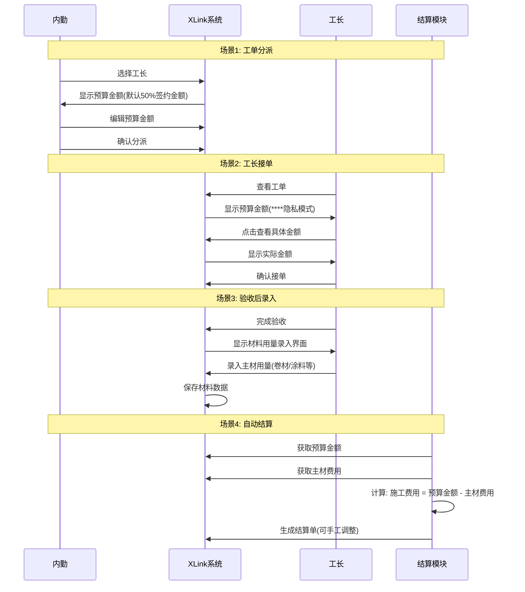
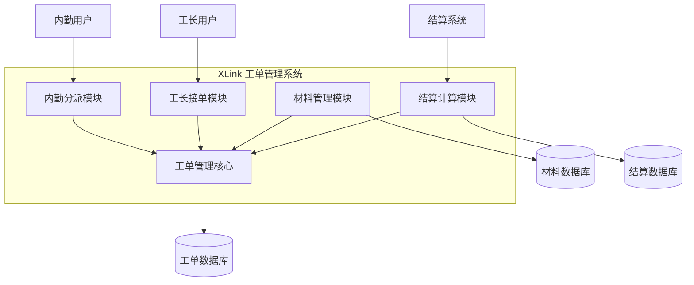

# XLink 预算管理功能需求分析与设计

## 📋 需求概述

**目标**：在现有工单流程中增加预算管理功能，实现从分派到结算的全流程预算控制。

**涉及角色**：
- 🏢 **内勤**：负责工单分派和预算设定
- 👷 **工长**：负责接单、施工和材料用量录入
- 💰 **结算系统**：自动计算施工费用

---

## 🎯 核心用户故事

### Story 1: 内勤设置预算
> **作为** 内勤人员  
> **我希望** 在分派工长时能够设置预算金额  
> **以便** 控制项目成本并为后续结算提供基准

### Story 2: 工长查看预算
> **作为** 工长  
> **我希望** 在接单时能够查看预算金额（带隐私保护）  
> **以便** 合理安排施工计划和材料采购

### Story 3: 工长录入材料用量
> **作为** 工长  
> **我希望** 在验收后能够录入实际材料用量  
> **以便** 为成本核算提供准确数据

### Story 4: 自动结算计算
> **作为** 结算系统  
> **我希望** 根据预算金额和材料费用自动计算施工费用  
> **以便** 提高结算效率和准确性

---

## 🔄 业务流程图



---

## 🏗️ 系统架构设计 (C4 - Context)



---

## 📱 界面设计要点

### 1. 内勤分派界面
```
┌─────────────────────────────────┐
│ 工单分派                          │
├─────────────────────────────────┤
│ 工长选择: [下拉选择框]              │
│ 预算金额: [￥12,500] [编辑]        │
│          (默认: 签约金额的50%)      │
│ [确认分派] [取消]                  │
└─────────────────────────────────┘
```

### 2. 工长接单界面
```
┌─────────────────────────────────┐
│ 工单详情                          │
├─────────────────────────────────┤
│ 项目地址: 某某小区                 │
│ 预算金额: [****] [👁️显示]         │
│ 工期要求: 3天                     │
│ [接受工单] [拒绝]                  │
└─────────────────────────────────┘
```

### 3. 材料录入界面
```
┌─────────────────────────────────┐
│ 材料用量录入                       │
├─────────────────────────────────┤
│ 卷材: [___] 平方米                │
│ 涂料: [___] 桶                    │
│ 其他: [___] [单位选择]             │
│ [保存] [取消]                     │
└─────────────────────────────────┘
```

---

## 🔧 技术实现要点

### 数据模型扩展
```sql
-- 工单表增加字段
ALTER TABLE work_orders ADD COLUMN budget_amount DECIMAL(10,2);
ALTER TABLE work_orders ADD COLUMN material_cost DECIMAL(10,2);

-- 材料用量表
CREATE TABLE material_usage (
    id BIGINT PRIMARY KEY,
    work_order_id BIGINT,
    material_type VARCHAR(50),
    quantity DECIMAL(10,2),
    unit VARCHAR(20),
    cost DECIMAL(10,2)
);
```

### 核心业务逻辑
```javascript
// 预算金额计算
function calculateDefaultBudget(contractAmount) {
    return contractAmount * 0.5;
}

// 施工费用计算
function calculateConstructionFee(budgetAmount, materialCost) {
    return Math.max(0, budgetAmount - materialCost);
}
```

---

## ✅ 验收标准

### 功能验收
- [ ] 内勤可以在分派时设置预算金额
- [ ] 预算金额默认为签约金额的50%
- [ ] 工长可以查看预算金额（隐私保护）
- [ ] 工长可以录入材料用量
- [ ] 结算自动计算施工费用
- [ ] 结算金额支持手工调整

### 性能验收
- [ ] 预算设置响应时间 < 2秒
- [ ] 材料录入保存时间 < 3秒
- [ ] 结算计算时间 < 5秒

---

## 🚀 实施计划

### Sprint 1 (1周)
- 数据库表结构设计和创建
- 内勤分派界面预算功能开发

### Sprint 2 (1周)  
- 工长接单界面预算显示功能
- 隐私保护功能实现

### Sprint 3 (1周)
- 材料用量录入功能开发
- 材料清单配置管理

### Sprint 4 (1周)
- 结算计算逻辑实现
- 端到端测试和优化

---

## 📊 风险评估

| 风险项 | 影响程度 | 应对措施 |
|--------|----------|----------|
| 材料清单不完整 | 中 | 与业务团队确认标准材料清单 |
| 隐私功能实现复杂 | 低 | 采用前端显示控制方案 |
| 结算逻辑冲突 | 高 | 详细测试现有结算流程 |

